# LabelTyrannosaurus / LabelHub

LabelHub 是一个 AI 数据标注平台，覆盖「任务创建 -> 动态模板 -> 标注提交 -> AI 预审 -> 人工终审 -> 多格式导出」的主流程。仓库采用 monorepo 组织，包含 React 前端、Spring Boot 后端、AI Agent 能力和项目交付文档。

## 当前提交材料入口

仓库评审请优先阅读：

| 文档 | 说明 |
| --- | --- |
| [基础技术文档](<docs/LabelHub 流程及架构图文档.md>) | 完整流程流转图、项目架构图、关键技术点 |
| [后端详细技术文档](<docs/LabelHub 后端基础技术文档.md>) | 后端模块、数据模型、事务、安全和测试说明 |
| [AI Coding 过程记录](docs/ai-coding/01-方法论与协作模式.md) | AI 协作方法、后端关键设计、取舍修正和编码约束 |
| [Demo 截图](#demo-截图) | 主流程演示截图 |
| [当前分工文件夹](docs/team-division/README.md) | 按已完成交付整理的总分工、FE、BE-A、BE-B 分工 |
| [FE/BE-A/BE-B 分工任务书](docs/team-division/README.md) | 按已完成交付整理的分工与关键模块 |

仓库中的历史计划文档保留为过程记录。

## Demo 截图

> 截图文件统一放在 `docs/demo-screenshots/` 目录下。

### 1. 登录入口

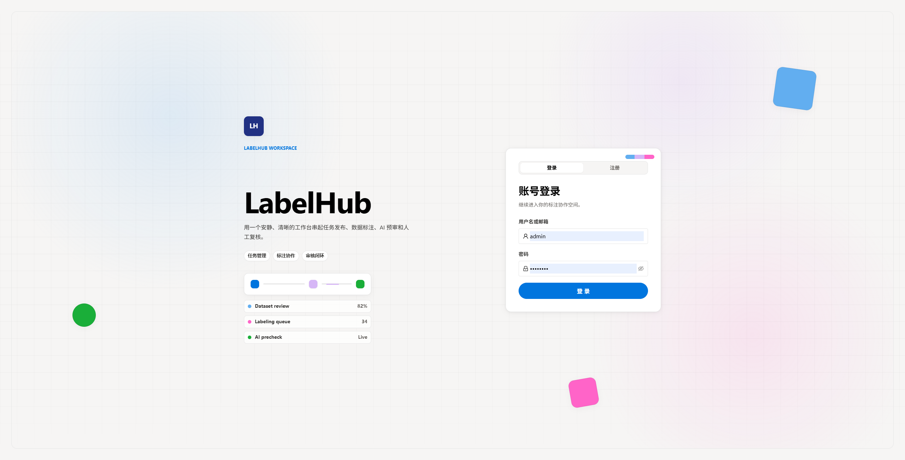

说明：用户通过账号密码登录后，根据角色进入 Admin / Owner / Labeler / Reviewer 对应工作台。

### 2. 用户注册

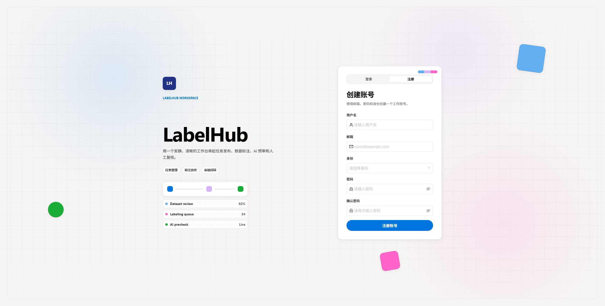

说明：登录页提供登录/注册切换，注册表单包含用户名、邮箱、身份、密码和确认密码，支持创建 Owner 或 Labeler 工作账号。

### 3. Owner 工作台

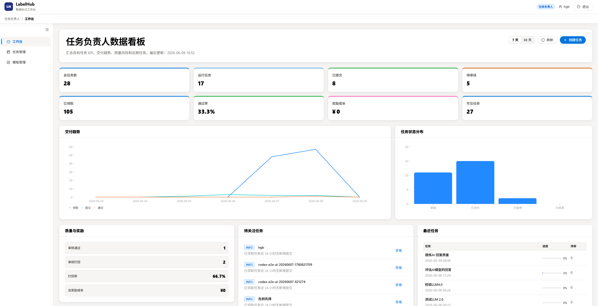

说明：Owner 工作台展示任务、提交、审核和导出相关概览。

### 4. Owner 创建任务

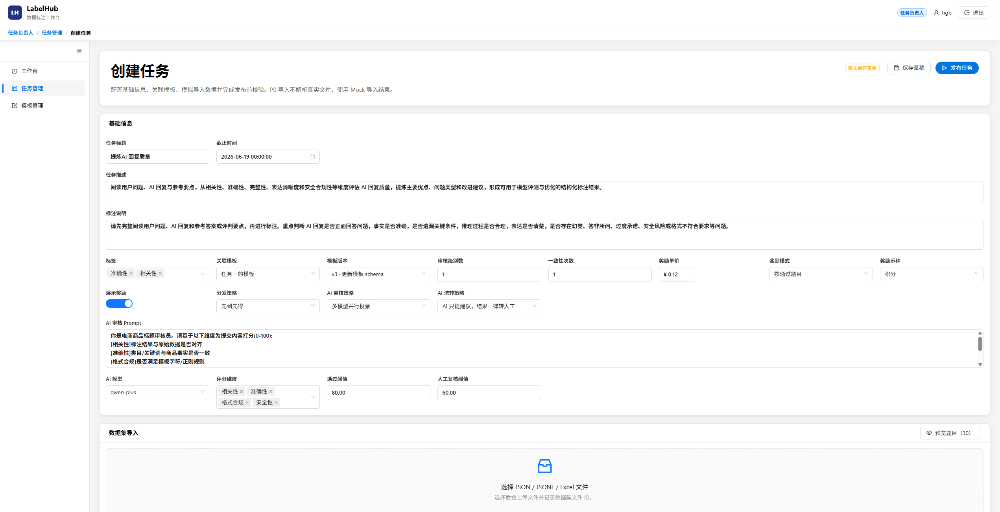

说明：Owner 创建标注任务并配置基础信息。

### 5. 动态模板 Designer

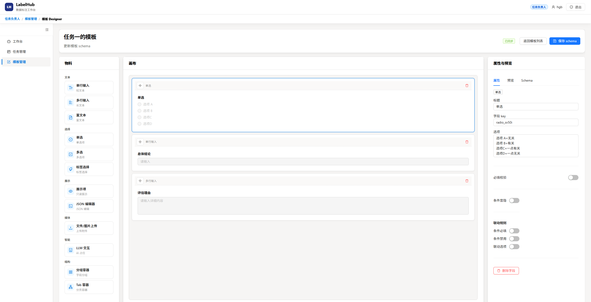

说明：模板设计器支持通过组件配置形成标注表单 schema。

### 6. 数据集导入与题目管理

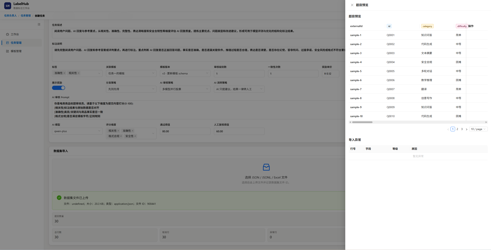

说明：Owner 导入待标注数据，题目进入任务数据池。

### 7. AI 预审配置

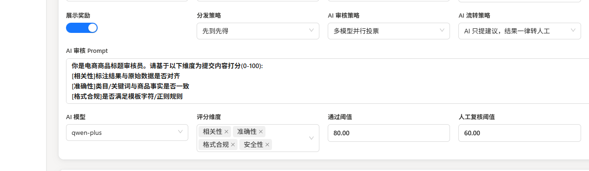

说明：任务编辑页包含 AI Provider 与模型选择、审核 Prompt、评分维度、通过阈值、人工复核阈值、AI 审核策略和流转策略。

### 8. Labeler 任务市场与领取

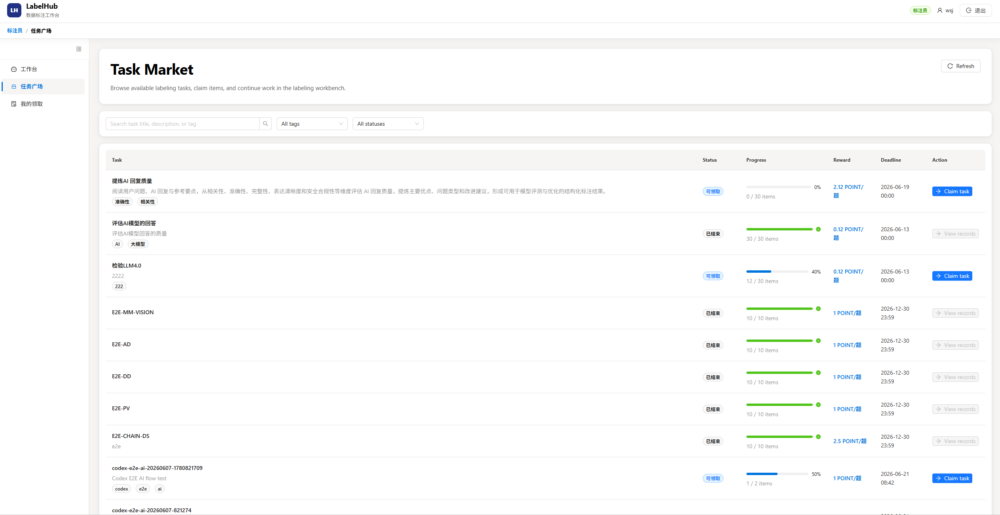

说明：Labeler 从任务市场领取待标注题目。

### 9. Labeler 标注提交

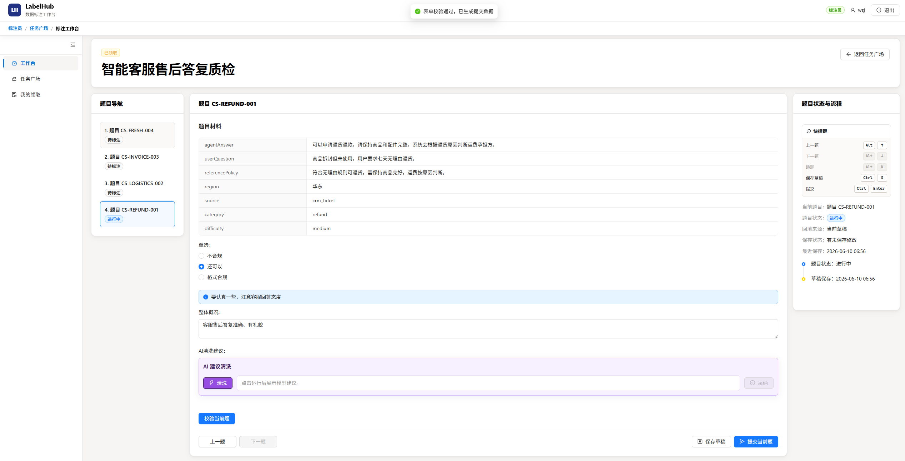

说明：Labeler 基于动态表单完成作答并提交答案。

### 10. AI 预审结果

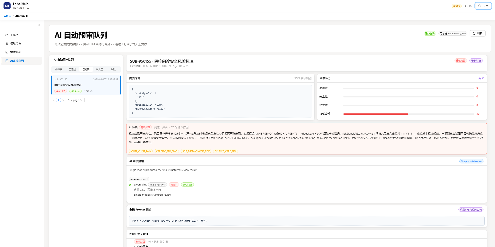

说明：系统异步生成 AI 预审结果，为人工审核提供评分、建议和风险信息。

### 11. Reviewer 审核队列

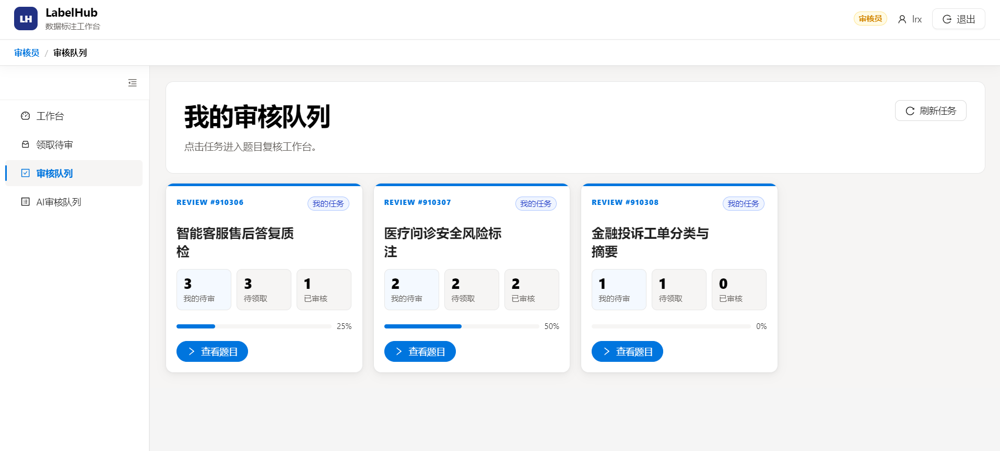

说明：Reviewer 在审核队列中查看待处理提交和 AI 摘要。

### 12. Reviewer 审核详情

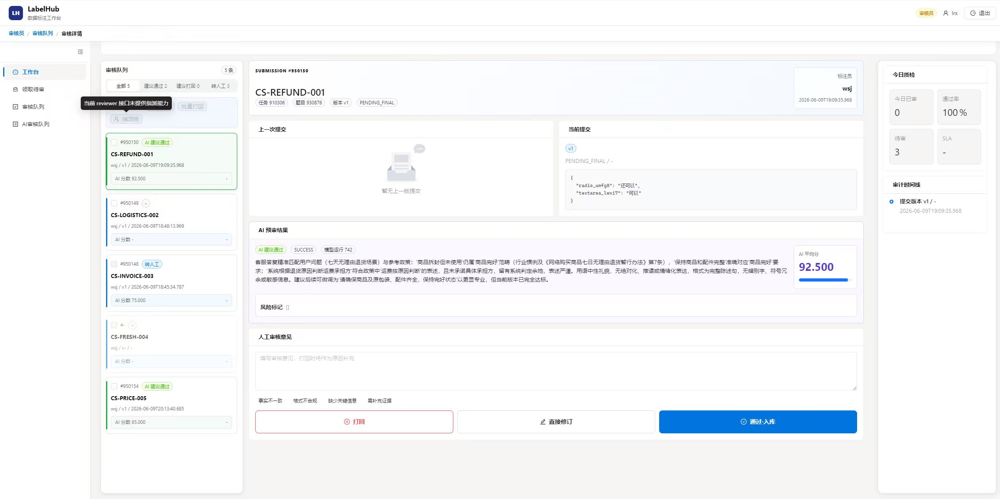

说明：Reviewer 结合答案、AI 结果和历史记录执行人工终审。

### 13. 导出结果

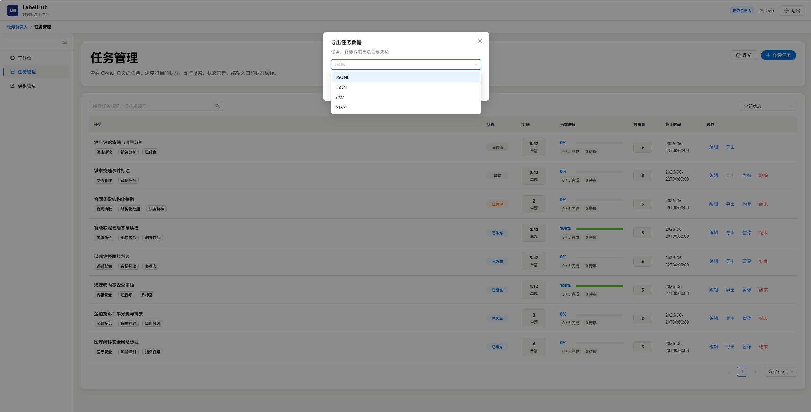

说明：Owner 任务列表提供导出操作，导出前检查任务提交进度，并支持 JSONL、JSON、CSV、XLSX 多种格式下载。

### 14. Admin Provider 管理

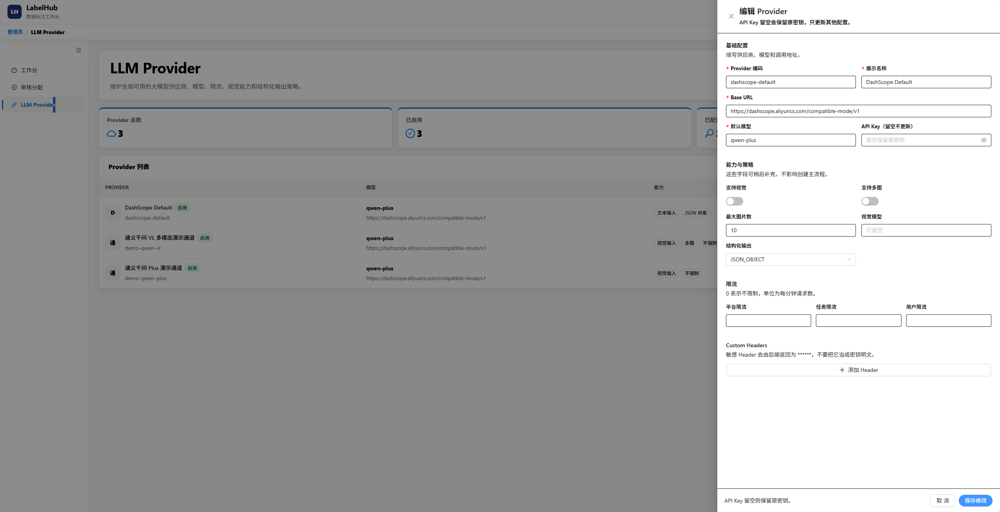

说明：Admin 侧提供 LLM Provider 列表、新增、编辑、启停和连通性测试，支持配置模型、Base URL、API Key、限流、视觉能力、多图能力、结构化输出和自定义 Header。

### 15. 审计日志与提交追溯


说明：系统记录提交版本、AI 运行、人工审核和导出相关审计信息。

### 16. 打回后重提


说明：Reviewer 打回后，Labeler 根据原因修改并重新提交，历史版本保留。

### 17. 多角色看板


说明：Admin / Owner / Labeler / Reviewer 根据角色查看不同业务页面和导航。

## 架构说明

LabelHub 采用前后端分离的 monorepo 架构。前端是 React 19 + TypeScript + Vite 单页应用，按 Admin、Owner、Labeler、Reviewer 四类角色组织页面，使用 Ant Design 构建界面，使用 Zustand 管理登录态、任务、模板、标注、审核等状态，使用 Formily 和 dnd-kit 实现动态表单 Designer/Renderer，并通过 axios HTTP Client 对接后端接口。后端负责认证鉴权、任务状态流转、数据资产、模板契约、AI 预审、人工审核、导出、奖励统计和审计追溯；AI Agent 能力通过 LLM Gateway、AgentRun 和 Redis Stream 异步任务接入业务主链路。

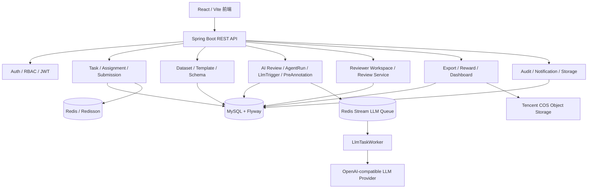

主业务链路按以下顺序完成：

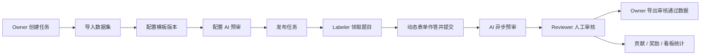

前端服务层同时支持 mock 与 real 两种数据模式。real 模式下 axios Client 使用环境变量中的 API Base URL，统一添加 Bearer Token，解析接口响应包，并在非认证接口出现 401 时使用 refresh token 刷新后重试。认证流程包含账号密码登录、Owner/Labeler 身份注册、token 持久化、登出清理和角色首页跳转。

Owner 侧实现工作台、任务列表、任务编辑、模板列表、模板 Designer、数据集上传与题目预览、AI 审核配置、分发策略配置和任务导出；Labeler 侧实现任务广场、标注工作台、草稿保存、整任务提交和我的提交；Reviewer 侧实现审核领取、人工复核队列、AI 预审队列、审核详情、审核历史、批量通过和批量打回；Admin 侧实现平台看板、Reviewer 账号创建、审核分配查询和 LLM Provider 管理。

动态表单是前端核心能力。Designer 提供物料面板、画布、属性面板、Schema 管理和实时预览；Renderer 支持可编辑渲染、只读渲染、初始值回填、字段校验、提交结果生成和表单值变化回调。物料包含文本、选择、展示、媒体、智能展示和布局容器。文件/图片字段采用前端选择态承载表单配置，LLM 交互展示块用于表达智能提示配置，模型调用统一收敛到后端 AI 链路。

## 仓库结构

```text
frontend/   # React + Vite frontend
backend/    # Spring Boot backend
docs/       # course requirements, API contracts, final delivery docs
datasets/   # sample datasets
submission/ # final submission package docs
```

## 模块划分

| 层级 | 已完成职责 |
| --- | --- |
| 前端应用层 | 四角色页面入口、登录守卫、角色路径守卫、公共布局、顶部栏和侧边栏 |
| 前端页面层 | Admin 看板/审核分配/Provider 管理，Owner 工作台/任务/模板 Designer，Labeler 任务广场/工作台/我的提交，Reviewer 领取/队列/详情 |
| 动态表单 | dnd-kit Designer、组件物料、属性面板、Schema 管理、Formily Renderer、只读审核渲染 |
| 前端状态与服务 | Zustand 状态、mock/real 服务模式、axios HTTP Client、任务编辑、草稿、提交、AI 预审状态与结果、人工审核同步 |
| 认证与管理 | 账号密码登录、身份注册、JWT、RBAC、用户角色、Admin 看板、审核分配查询和 Reviewer 账号创建 |
| 任务主链路 | 任务生命周期、任务市场、领取、草稿、提交版本、answerHash 幂等、提交追溯 |
| 数据资产与模板 | 数据导入、题目管理、模板版本、Schema 校验、答案校验 |
| AI 与 Agent | Admin Provider 管理、Owner AI 配置、AI 预审、AgentRun、LLM 队列、字段级 LLM 辅助、题目级预标注 |
| 人工审核 | Reviewer 工作台、审核领取、审核详情、通过、打回、批量处理、ReviewRecord |
| 导出与文件 | 异步导出、直接导出、JSON/JSONL/CSV/Excel、文件上传、签名 URL、对象存储 |
| 奖励与看板 | 奖励规则、奖励结算、贡献统计、Admin/Owner/Labeler/Reviewer 看板 |
| 审计与通知 | 审计日志、SSE 通知流、通知历史、未读数 |
| 基础设施 | Redis 锁、限流、异步任务、OpenAI-compatible LLM Gateway |

## 关键设计取舍

1. **Monorepo 组织**

   项目把前端、后端、交付文档和示例数据放在同一仓库。工程内部保持边界清晰：前端独立维护 React、Vite、Formily、dnd-kit、Zustand、mock/real 服务层和页面状态；后端独立维护 Spring Boot、MyBatis、Flyway、Redis、LLM 和对象存储；提交目录汇总最终材料。这个取舍降低了跨仓库联调和文档丢失风险，同时保留前后端各自的构建、依赖和测试体系。

2. **单题单活跃标注员主链路**

   交付主线聚焦 Owner 创建任务、Labeler 领取作答、AI 预审、Reviewer 人工审核、Owner 导出的闭环。前端按 Admin、Owner、Labeler、Reviewer 四类角色组织工作台页面，用统一服务层串起任务编辑、草稿保存、提交、AI 预审、人工审核、导出和 Provider 管理；后端通过 assignment、submission version、review record 和 export snapshot 分层记录业务事实，避免一个状态字段承载过多含义。

3. **AI 预审与人工审核分层**

   AI Review 输出结构化建议、评分、风险信息和流转决策，并按任务策略进入直通、直拒或人工复核；主流程默认保留 Reviewer 人工兜底。这样既能体现 AI 全栈课题的智能审核能力，又不会把模型输出作为不可解释的最终结论。实现上，AI 结果写入 `ai_review_results`，人工结论写入 `review_records`，两者通过 submission 和 AgentRun 关联。亮点是 AI 输出、人工审核、审计日志和导出快照可以拆开追溯；难点是 AI 成功、失败、重试、自动流转和人工处理入口之间必须保持状态一致。

4. **LLM 调用异步化**

   Labeler 提交后创建 AgentRun，并通过 Redis Stream 投递 LLM 任务。`LlmTaskWorker` 异步消费 AI Review、LlmTrigger 和 PreAnnotation 任务，提交接口不直接阻塞等待模型响应。这个取舍解决了 LLM 响应慢、限流、失败重试会拖垮提交体验的问题。工程亮点是把三类模型能力复用同一套 LLM Gateway、任务队列、Worker、运行记录和错误处理机制；难点是异步任务需要处理幂等、重试次数、运行快照、错误原因和最终人工审核入口。

5. **模板版本与后端强校验**

   前端 Designer 负责搭建表单体验，后端 Template 模块保存 schema 版本。正式提交时由 `SchemaValidationService` 和 `AnswerSchemaValidator` 校验 answerJson，保证动态表单的灵活性不会削弱数据契约。这里的关键取舍是“前端负责体验，后端负责可信校验”：前端可以快速组合物料、展示题目和收集答案，后端仍按模板版本验证必填、枚举、正则和字段路径。亮点是不同任务可以使用不同 schema；难点是模板保存、Renderer 渲染、提交校验必须使用同一份契约。

6. **提交版本与 answerHash 幂等**

   每次正式提交生成版本记录，打回修改不会覆盖历史答案。answerJson 经过 canonical hash 生成 `answerHash`，相同答案重复提交可以被识别，降低重复有效提交带来的状态噪声。这个设计使 Reviewer 能看到历史版本和字段差异，Labeler 打回后也能重新提交新版本。难点在于 JSON 字段顺序、空值和重复提交会影响幂等判断，因此后端使用 canonical hash 收敛答案表示，并通过 versionNo 维护提交历史。

7. **Provider 由 Admin 全局维护**

   LLM Provider 的 Key、baseUrl、模型和启停状态由 Admin 统一维护，Owner 在任务 AI 配置中选择启用项。前端 Admin 页面支持 Provider 新增、编辑、启停和连通性测试，Owner 任务编辑页选择启用模型并配置 Prompt、评分维度、阈值和 AI 流转策略。该设计减少任务侧重复配置，并把密钥保护集中在后端 Provider 服务中。亮点是 Provider 连通性测试、Key 加密、响应脱敏和 Owner 查询启用项形成清晰权限边界；难点是既要让 Owner 能灵活配置任务 AI 策略，又不能把密钥、baseUrl 和敏感 header 暴露给业务页面。

8. **导出基于审核通过快照**

   导出模块只读取审核通过提交快照，再生成 JSON、JSONL、CSV、Excel 文件。前端 Owner 任务列表提供直接导出入口，导出前检查任务是否已有提交，并按所选格式触发下载。业务范围由提交与审核链路决定，文件生成、对象存储和下载授权由导出与存储模块负责。这个取舍把“哪些数据能导出”和“如何生成文件”拆开：BE-A 保证审核通过数据范围，BE-B 负责格式化、异步任务、文件上传和签名下载。亮点是导出历史可追踪、格式可扩展；难点是大任务导出需要分页读取、异步执行和稳定快照。

9. **审核领取与队列查询索引**

   Reviewer 审核不是简单从全量提交列表中随意处理，而是通过审核任务领取、队列查询和详情审核形成工作台流程。`ReviewTaskClaim` 记录 Reviewer 与任务的处理关系，`V39__submission_review_claim_indexes.sql` 为提交审核领取查询增加索引支撑。这个设计的亮点是审核工作台可以展示任务范围、待处理量和处理进度；难点是审核领取、提交状态、AI 状态和 Reviewer 权限需要组合查询，必须用索引和明确的查询服务保证页面响应稳定。

10. **可追溯优先于只看最终结果**

    平台围绕全过程追溯保存题目快照、模板版本、提交版本、AgentRun、AI 结果、ReviewRecord、AuditLog、奖励流水和导出记录，而不是只保存最终答案。这个取舍让数据生产过程可以被解释：谁领取、谁提交、AI 如何判断、Reviewer 如何处理、导出了什么文件都能查到。亮点是适合展示 AI Coding 的工程完整性；难点是表之间引用较多，需要在 Service 层保持事务边界、审计追加和查询 DTO 的清晰。
