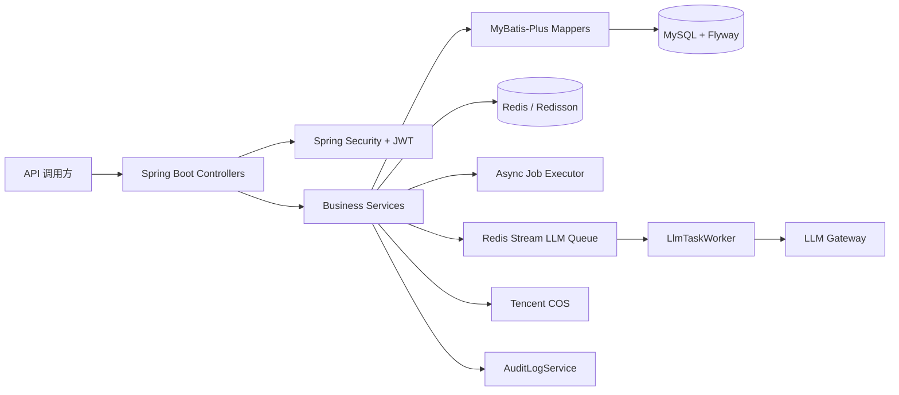
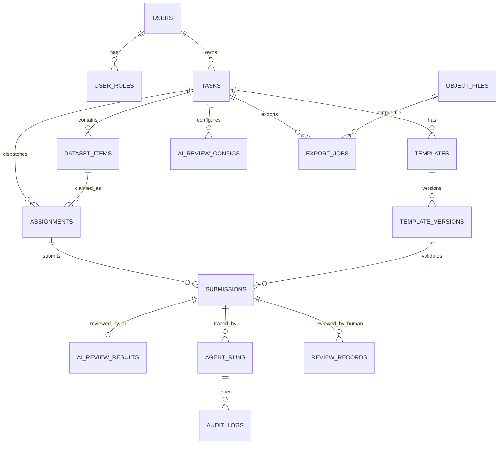
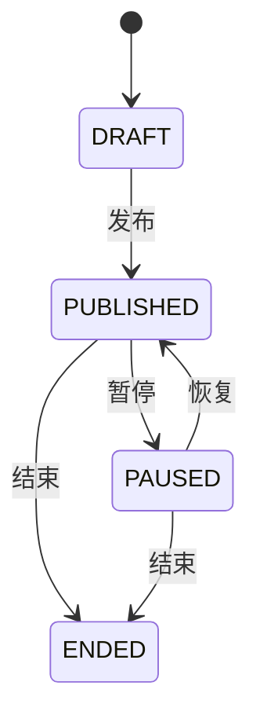
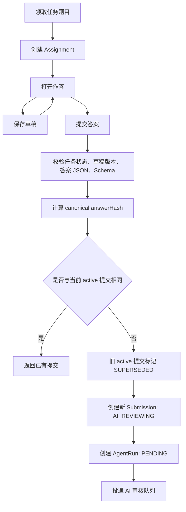
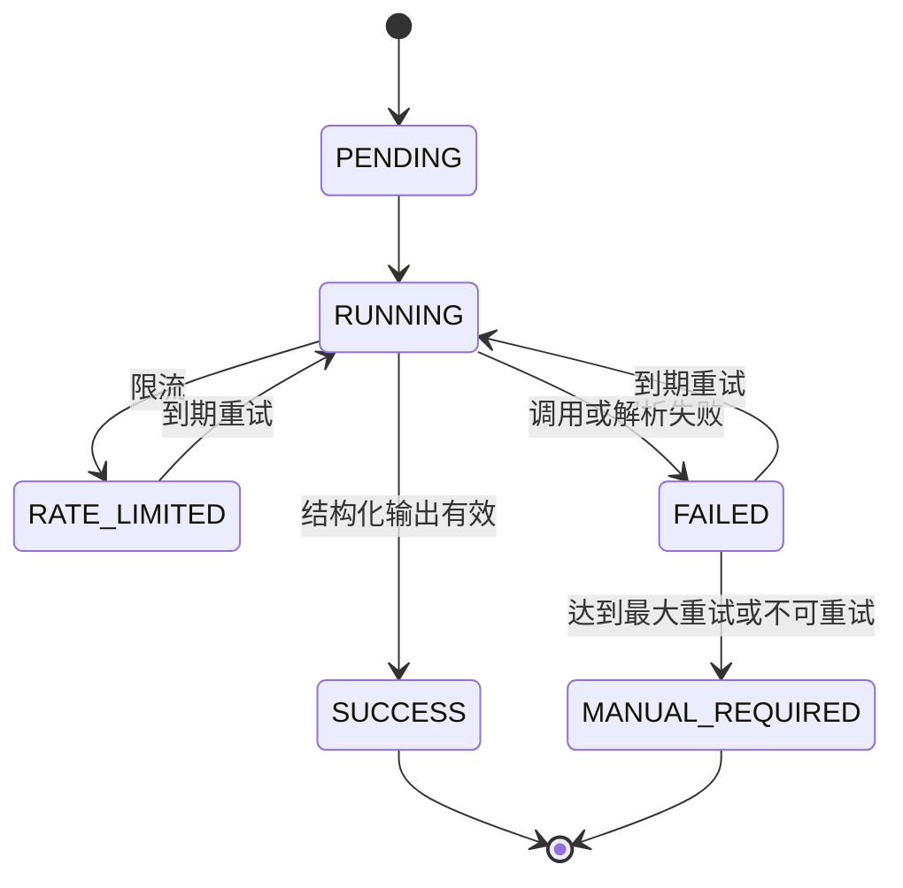
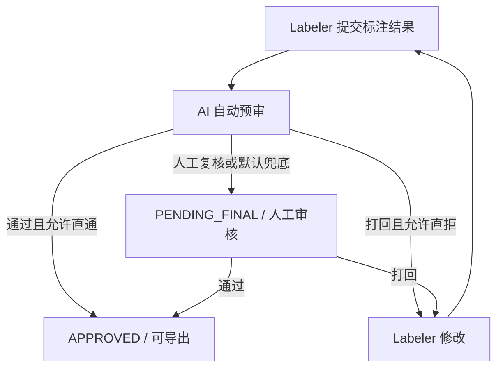
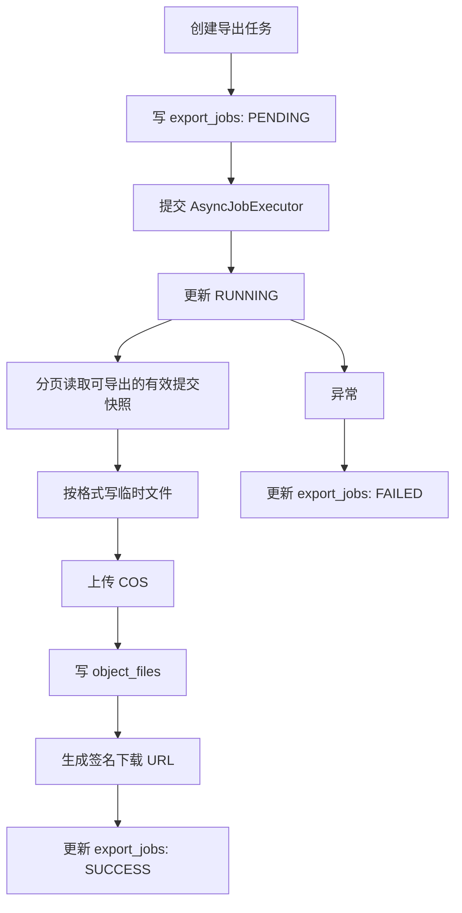

# LabelHub 后端基础技术文档

> 本文档基于当前仓库后端代码、`backend/pom.xml`、`backend/src/main/resources/application*.yml`、Flyway 迁移脚本以及 `docs/mysql-schema.sql` 编写。本文只描述后端基础技术设计，不展开完整 API 路径、请求参数、响应字段和错误码；详细接口应单独维护在 API 文档或 Postman Collection 中。

## 1. 项目概述

LabelHub 是一个面向 AI 数据生产场景的数据标注平台，后端在系统中承担接口服务、业务状态流转、权限认证、数据持久化、AI 自动预审、人工审核、文件存储、异步任务、数据导出和审计追踪等职责。

当前后端围绕「任务创建 -> 模板配置 -> 标注员领取任务 -> 在线标注 -> AI 自动预审 -> 人工审核 -> 数据导出」构建主链路：

- 任务负责人创建标注任务、导入待标注数据、配置任务模板、配置 AI 审核规则和奖励规则。
- 标注员在任务发布后领取题目，保存草稿，并提交正式标注结果。
- 系统在提交后创建 AI 审核运行记录，异步调用大模型生成结构化预审结果。
- 审核员查看标注结果、AI 评分和建议，执行通过、打回、修订等人工审核操作。
- 任务负责人或有权限用户对通过审核的数据发起 JSON、JSONL、CSV、Excel 等格式导出。
- 后端通过 JWT、RBAC、归属校验、事务、Redis 锁、Redis 限流、唯一索引、幂等键、SSE 实时通知和审计日志保证关键流程可靠。

## 2. 后端技术栈

| 技术 | 项目中用途 | 选择原因 |
| --- | --- | --- |
| Java / Maven | 后端开发语言与构建工具，`pom.xml` 使用 Spring Boot Parent 和 Maven 插件 | Spring Boot 3 项目基线，生态成熟，便于课程交付和本地运行 |
| Spring Boot 3.5.14 | Web API、依赖注入、配置管理、Actuator、AOP、Validation | 快速构建分层后端服务，适合模块化业务 |
| Spring Security | 无状态认证、接口鉴权、方法级权限控制 | 配合 JWT 和 RBAC 控制 Owner、Labeler、Reviewer、Admin、System Agent 权限边界 |
| JJWT | Access Token / Refresh Token 签发与解析 | Token 中携带用户、角色和 `tokenVersion`，支持角色或密码变更后失效旧令牌 |
| BCrypt | 密码哈希 | 避免明文存储密码 |
| MySQL | 核心业务数据持久化 | 支持事务、JSON 字段、唯一索引、全文索引和复杂状态表 |
| MyBatis-Plus | Entity / Mapper 数据访问 | 兼顾简单 CRUD 和注解 SQL 的复杂查询 |
| Flyway | 数据库迁移 | `src/main/resources/db/migration` 管理表结构演进和种子数据 |
| Redis / Redisson | 分布式锁、缓存、限流、Redis Stream LLM 队列 | 解决领取并发、AI 审核幂等、模板缓存、LLM 任务消费等问题 |
| ThreadPoolTaskExecutor | 数据集导入、数据导出等普通异步任务 | 避免导入导出阻塞 HTTP 请求线程 |
| Redisson Redis Stream | AI 审核、LLM Trigger、预标注等 LLM 任务队列 | 支持 consumer group、ack、pending claim 和跨实例消费 |
| Tencent COS SDK | 对象文件存储、签名下载 URL | 支持数据集文件、导出文件、错误报告等文件资产 |
| Spring AI Alibaba / DashScope 配置 | 默认大模型接入配置 | 作为默认模型供应商配置来源 |
| OpenAI-compatible LLM Gateway | 统一调用 OpenAI 兼容模型 Provider | 支持后台配置 Provider、模型、Key 和结构化输出 |
| Apache POI (5.3.0) | Excel 数据导入和导出 | 支持 `.xls/.xlsx` 解析与 XLSX 导出 |
| spring-dotenv (4.0.0) | 本地开发环境变量加载 | 支持 `.env` 文件配置，便于本地启动时注入密钥和连接信息 |
| springdoc-openapi / Knife4j | 本地和开发环境 API 文档查看 | 默认 profile 关闭，`local/dev` profile 开启 |
| JUnit 5 / Mockito / AssertJ | 单元测试和服务测试 | 覆盖状态机、AI、导入导出、权限、Mapper、配置等关键流程 |

说明：当前代码未发现 Dockerfile 或 docker-compose 部署编排，部署方式以 Maven 构建和 Spring Boot 启动为主。

## 3. 后端整体架构

后端位于 `backend/`，采用按业务模块拆分的分层结构：

```text
backend/
  src/main/java/com/labelhub/
    LabelHubApplication.java
    common/
      api/              # 统一响应、分页
      audit/            # 审计追加端口
      config/           # OpenAPI 配置
      constant/         # 全局常量
      dto/              # 通用 DTO
      exception/        # 业务异常、全局异常处理
      security/         # JWT、当前用户上下文、Spring Security 配置
      user/             # 系统用户映射
      util/             # 答案 canonical hash 等工具
      web/              # traceId
    infrastructure/
      ai/               # AI 审核队列基础设施（Redis Stream 封装）
      async/            # 普通异步任务线程池
      llm/              # LLM Gateway 与 OpenAI-compatible Adapter
      llmtask/          # Redis Stream LLM 任务队列与 Worker
      notification/     # SSE 实时通知管理与推送
      redis/            # Redis 锁、限流、KeyBuilder
      storage/          # COS 对象存储适配
    modules/
      auth/             # 登录注册、用户、角色
      admin/            # Admin 管理能力
      task/             # 任务生命周期
      dataset/          # 数据集导入、题目管理、题目领取预留
      template/         # 模板与 Schema 版本
      assignment/       # 领取、草稿、标注工作台
      submission/       # 提交、版本、导出快照
      ai/               # AI 审核配置、执行、重试、LLM Provider
      agent/            # AgentRun 与系统 Agent 身份
      review/           # 人工审核、批量审核、审核任务
      export/           # 异步数据导出
      storage/          # 文件上传和签名 URL
      audit/            # 审计日志落库和查询
      reward/           # 奖励规则、贡献账本
      role/dashboard/   # 角色看板统计
      media/            # 媒体资产处理与上下文注入
      notification/     # SSE 实时通知推送
      preannotation/    # AI 预标注
```

整体分层职责如下：

| 层 | 代码位置 | 职责 |
| --- | --- | --- |
| Controller / Web | `modules/*/controller`、`modules/*/web` | 接收 HTTP 请求、参数校验、调用 Service、返回统一响应，不承载复杂业务状态流转 |
| Service | `modules/*/service` | 核心业务逻辑、状态机迁移、事务控制、幂等控制、跨模块协作 |
| Mapper / Repository | `modules/*/mapper`、`modules/*/repository` | MyBatis-Plus CRUD 与注解 SQL 查询、条件更新、分页 |
| Domain / Entity | `modules/*/domain` | 映射数据库表和核心枚举状态 |
| DTO / VO | `modules/*/dto` | 请求和响应对象，隔离接口入参出参与数据库实体 |
| Infrastructure | `infrastructure/*` | Redis、LLM、异步线程池、对象存储等技术适配 |
| Common | `common/*` | 统一响应、异常、审计端口、鉴权上下文、traceId |

架构关系：



## 4. 核心业务模型

| 领域对象 | 实际代码 / 表 | 说明 |
| --- | --- | --- |
| User | `UserEntity` / `users` | 系统用户，区分普通用户和系统用户，存储登录状态、密码哈希、`tokenVersion` |
| Role | `UserRoleEntity` / `user_roles` | 用户角色，当前业务约束为单用户单角色 |
| Task | `Task` / `tasks` | 标注任务主表，包含负责人、状态、配额、截止时间、领取策略、发布模板版本、AI 审核配置 |
| Dataset Item | `DatasetItem` / `dataset_items` | 待标注题目，保存标准化 `item_json`、外部 ID、分配/提交/通过计数 |
| Dataset Import | `DatasetFileEntity`、`DatasetImportJobEntity` / `dataset_files`、`dataset_import_jobs` | 数据源文件和异步导入任务 |
| Template / Schema | `TemplateEntity`、`TemplateVersion` / `templates`、`template_versions` | 模板主表和不可变版本快照，Schema 保存为 JSON |
| Assignment | `Assignment` / `assignments` | 标注员对某个题目的领取记录，同时承载服务端草稿和草稿版本 |
| Submission | `Submission` / `submissions` | 正式提交版本，保存答案 JSON、答案哈希、审核状态、人工审核路由状态 |
| AiReviewConfig | `AiReviewConfig` / `ai_review_configs` | 每个任务的 AI 审核 Provider、模型、Prompt、评分维度、阈值和流转策略 |
| AgentRun | `AgentRun` / `agent_runs` | 单次 AI/LLM 运行尝试，用于输入快照、输出快照、耗时、错误和 trace 追溯 |
| AiReviewResult | `AiReviewResult` / `ai_review_results` | 某条提交的业务级 AI 预审结果，与 `agent_runs` 解耦 |
| Manual Review | `ReviewTask`、`ReviewRecord` / `review_tasks`、`review_records` | 审核任务队列和人工审核动作记录 |
| AuditLog | `AuditLogEntity` / `audit_logs` | 只追加审计日志，记录关键状态迁移和业务操作快照 |
| ExportTask | `ExportJobEntity` / `export_jobs` | 数据导出任务配置、状态、结果文件和下载 URL |
| ObjectFile | `ObjectFileEntity` / `object_files` | COS 文件元数据，数据集文件、错误报告、导出文件都通过该表追踪 |
| MediaAsset | `MediaAssetEntity` / `media_assets` | 题目关联的媒体资产记录，支持图片、视频、文本、Markdown 等类型 |
| MediaDerivative | `MediaDerivativeEntity` / `media_derivatives` | 媒体衍生产物（视频关键帧、转写文本等） |
| PreAnnotation | `PreAnnotation` / `pre_annotations` | AI 预标注建议结果，标注员可参考或采纳 |
| AssignmentDispatch | `AssignmentDispatch` / `assignment_dispatches` | 指派记录，支持 ASSIGNED 分发策略的预分配和领取 |
| LlmTriggerRun | `LlmTriggerRun` / `llm_trigger_runs` | 字段级 LLM 触发器运行记录，含调用快照和结果 |
| ReviewTaskClaim | `ReviewTaskClaim` / `review_task_claims` | 审核员对 (任务, 审核层级) 的整任务领取记录 |

核心对象关系：



当前主流程是单人标注链路。

> 注：上方的 ER 图聚焦标注主链路的实体关系；`AssignmentDispatch`、`LlmTriggerRun`、`ReviewTaskClaim` 等辅助实体已在领域对象表中列出，但未在 ER 图中展开，以避免图过于复杂。

## 5. 用户与权限设计

角色枚举定义在 `RoleCode`：

```text
ADMIN, OWNER, LABELER, REVIEWER, SYSTEM_AGENT
```

| 角色 | 核心权限 | 典型业务操作 |
| --- | --- | --- |
| ADMIN | 平台管理权限 | 用户与角色管理、全局 LLM Provider 管理、跨 Owner 查询部分管理数据 |
| OWNER | 任务负责人权限 | 创建任务、导入数据、配置模板和 AI 审核、发布/暂停/结束任务、查看统计、发起导出 |
| LABELER | 标注员权限 | 浏览任务市场、领取题目、保存草稿、提交标注、查看自己的提交和贡献 |
| REVIEWER | 人工审核员权限 | 查看分配给自己的审核数据、通过、打回、批量审核 |
| SYSTEM_AGENT | 系统自动审核身份 | 作为 AI Agent 写入审核结果和审计记录，不参与普通登录 |

认证流程：

1. 注册：`AuthService.register` 只允许公开注册 `OWNER` 或 `LABELER`，写入 `users` 和 `user_roles`，密码使用 BCrypt。
2. 登录：`AuthService.login` 校验账号状态、密码和单角色约束，签发 accessToken 与 refreshToken。
3. 刷新：refreshToken 中的 `tokenVersion` 必须与数据库一致，密码修改、角色修改或账号停用后旧 token 失效。
4. 请求鉴权：`JwtAuthenticationFilter` 从 `Authorization: Bearer` 或 `token` 参数读取 accessToken，解析后写入 `SecurityContext` 和 `CurrentUserContext`。
5. 权限控制：`SecurityConfig` 开启 `@EnableMethodSecurity`，Controller 和 Service 通过角色、当前用户和数据归属共同控制权限。

越权防护边界：

- Owner 访问任务、数据集、模板、导出时，Service 会校验 `owner_id`；Admin 可作为管理角色绕过部分归属限制。
- Labeler 领取和提交时，不能代替其他用户领取或提交；`AssignmentClaimService` 校验当前用户必须是 `LABELER`。
- Reviewer 审核时，`ReviewService.requireAssignedReviewer` 校验当前审核员必须是提交记录上的 `assignedReviewerId`，Admin 例外。
- 文件下载签名 URL 由 `FileService.generateSignedUrl` 校验文件 owner 或 Admin 权限后生成。

当前实现边界：系统用户和 Reviewer 通常由后台或种子数据创建，不开放普通注册。

## 6. 任务管理模块设计

任务状态枚举为 `TaskStatus`：

| 状态 | 含义 | 允许的主要操作 |
| --- | --- | --- |
| `DRAFT` | 草稿 | 编辑任务、导入/覆盖数据集、绑定模板、配置 AI、删除草稿、发布 |
| `PUBLISHED` | 发布中 | Labeler 领取题目、提交标注；Owner 可暂停或结束 |
| `PAUSED` | 已暂停 | 暂停领取和提交入口；Owner 可恢复或结束 |
| `ENDED` | 已结束 | 不允许继续领取或提交；保留查询和导出能力 |

状态机：



`TaskLifecycleService` 使用事务保护创建、更新、发布、暂停、恢复和结束操作。非法状态迁移会抛出 `BusinessException`，例如非草稿不能编辑、非发布不能暂停、非发布/暂停不能结束。

发布前校验由 `validatePublishRequirements` 和 `TaskPublishDependencyChecker` 完成，主要包括：

- 配额必须有效。
- 任务创建时会校验基础配置完整性。
- 截止时间必须晚于当前时间。
- 数据集不能为空。
- `publishedTemplateVersionId` 必须存在。
- 任务必须有 AI 审核配置。
- 任务必须有奖励规则。
- `ASSIGNED` 策略必须有指派记录或默认指派 Labeler。

领取策略枚举为 `ClaimStrategy`：

| 策略 | 含义 | 当前实现 |
| --- | --- | --- |
| `FCFS` | 先到先得 | 从可领取题目中按 ID 顺序领取 |
| `QUOTA_GRAB` | 配额抢单 | 控制任务总领取数和单人最大领取数 |
| `ASSIGNED` | 指派 | 通过 `assignment_dispatches` 或默认指派 Labeler 预分配 |

任务状态变更会写入 `audit_logs`，动作包括 `TASK_CREATED`、`TASK_UPDATED`、`TASK_PUBLISHED`、`TASK_PAUSED`、`TASK_RESUMED`、`TASK_ENDED`、`TASK_DELETED`。

## 7. 数据集与题目管理模块

数据集导入由 `DatasetImportService` 负责，核心表包括 `object_files`、`dataset_files`、`dataset_import_jobs`、`dataset_items` 和 `dataset_item_change_logs`。

当前支持：

- 上传源文件到 COS，并在 `object_files` 保存元数据。
- 创建导入任务，异步解析并写入 `dataset_items`。
- 支持 JSON、JSONL、Excel 解析；CSV 在 `DatasetFileFormat` 和数据库约束中预留，但当前导入服务会拒绝 CSV 解析。
- 支持 `APPEND` 和 `OVERWRITE` 两种导入模式；覆盖导入只允许草稿任务执行。
- 行级失败会生成 JSONL 错误报告文件，成功行仍可入库，导入任务状态可为 `SUCCESS`、`FAILED` 或 `PARTIAL_SUCCESS`。
- 直接追加 JSON 内容时会生成一份虚拟源文件并走相同导入任务模型。

题目存储：

- `dataset_items.external_id` 是同一任务内业务唯一键。
- `item_json` 保存标准化题目内容，`metadata_json` 保存补充元数据。
- `assigned_count`、`submitted_count`、`approved_count` 用于题目生命周期统计。
- `deleted` 用于覆盖导入或删除时软删除题目。

并发领取控制：

- `AssignmentClaimService` 对同一任务领取使用 Redis 锁：`lock:claim:task:{taskId}`。
- `DefaultDatasetClaimService` 先查可领取题目，再用 `reserveIfAvailable` 条件更新 `assigned_count = 1`。
- `assignments` 有 `uk_assignments_item_labeler(dataset_item_id, labeler_id)` 唯一约束。
- `DatasetItemMapper` 查询可领取题目时排除非 `CANCELLED` 的 assignment，避免重复领取。
- `QUOTA_GRAB` 额外通过 `TaskMapper.tryIncrementClaimedCount` 控制任务配额。

当前边界：答辩中按单题单活跃标注员流程说明。

## 8. 标注模板 Schema 模块

模板相关主表：

- `templates`：模板主表，包含 `owner_id`、`task_id`、`name`、`current_version_no`、`created_by`。
- `template_versions`：模板版本表，包含 `template_id`、`task_id`、`owner_id`、`version_no`、`schema_json`、`published_snapshot`、`change_note`。

后端职责：

- 保存模板主表和不可变版本快照。
- 将 Schema 以 JSON 字符串保存到 `template_versions.schema_json`。
- 在任务发布或提交时使用 `published_template_version_id` 绑定稳定版本。
- 对 Schema 和答案进行后端基础校验，避免只依赖客户端。
- 缓存模板版本 Schema，`DefaultTemplateSchemaService` 使用 Redisson bucket，TTL 为 6 小时。

`SchemaValidationService` 是当前 `@Primary` 的 Schema 和答案校验服务，支持：

- 校验 `schema_json` 必须是 JSON 对象。
- 校验 `components` 必须是数组。
- 校验组件必须有合法的 `type`。
- 非容器、非 `ShowItem` 组件需要有 `field`。
- 检测重复 field。
- 支持嵌套 `children` / `components`。
- `ShowItem` 字段只能展示原始题目数据，禁止出现在作答内容中。
- 对答案校验必填、枚举和正则。

示意 Schema 结构：

```json
{
  "components": [
    {
      "type": "ShowItem",
      "field": "sourceText"
    },
    {
      "type": "TextArea",
      "field": "answer",
      "required": true,
      "regex": "^.{1,500}$"
    },
    {
      "type": "Radio",
      "field": "label",
      "required": true,
      "enum": ["positive", "negative", "neutral"]
    }
  ]
}
```

实现边界：后端不处理拖拽画布、组件样式和运行时渲染，后端只关注 Schema 存储、版本冻结、权限和基础校验。

## 9. 标注草稿与提交流程

标注流程涉及 `assignments` 和 `submissions` 两张核心表。`assignments` 表示领取和草稿状态，`submissions` 表示正式提交版本。

| 类型 | 存储位置 | 说明 | 是否进入审核 |
| --- | --- | --- | --- |
| Draft | `assignments.draft_answer_json`、`draft_version`，并缓存到 Redis | 临时保存，防止数据丢失，可多次覆盖 | 否 |
| Submission | `submissions.answer_json`、`answer_hash`、`version_no` | 正式提交版本，不直接覆盖历史版本 | 是 |

流程：



关键规则：

- 草稿保存只允许 `CLAIMED`、`DRAFTING`、`RETURNED` 状态。
- 草稿保存使用 `clientVersion` 与 `draft_version` 做乐观并发控制，版本不一致返回冲突。
- 提交只允许 `CLAIMED`、`DRAFTING`、`RETURNED` 状态。
- 提交前任务必须仍为 `PUBLISHED` 且未过截止时间。
- 提交前通过 `AnswerCanonicalizer` 规范化 JSON，并计算 SHA-256 `answerHash`。
- 相同答案重复提交直接返回已有提交，避免重复创建 AI 审核。
- 新答案重新提交时，旧 active 版本通过 `supersedeActiveByAssignmentId` 标记为 `SUPERSEDED`。
- 提交成功后创建 `AgentRun(PENDING)` 并通过 `AiReviewDispatcher` 投递 AI 审核任务。

状态枚举：

```text
AssignmentStatus:
CLAIMED, DRAFTING, SUBMITTED, AI_RETURNED, RETURNED, APPROVED, CANCELLED

SubmissionStatus:
SUBMITTED, AI_REVIEWING, PENDING_FINAL, APPROVED, REJECTED, SUPERSEDED
```

当前主提交链路创建提交时直接进入 `AI_REVIEWING`，AI 审核完成后再转入 `PENDING_FINAL`、`APPROVED` 或 `REJECTED`。

## 10. AI 自动预审 Agent 模块

AI 自动预审是当前后端重点模块，代码分布在 `modules/ai`、`modules/agent`、`infrastructure/llm` 和 `infrastructure/llmtask`。

核心组件：

| 组件 | 职责 |
| --- | --- |
| `AiReviewConfigService` | 保存任务级 AI Provider、模型、Prompt、评分维度、阈值和流转策略 |
| `SubmissionSubmitService` | 提交后创建 `AgentRun(PENDING)` 并投递 AI 审核 |
| `AsyncAiReviewDispatcher` | 将提交写入 Redis Stream LLM 队列 |
| `LlmTaskWorker` | 定时消费 Redis Stream，执行对应 `LlmTaskHandler` |
| `AiReviewLlmTaskHandler` | AI 审核任务 Handler，调用 `AiAutoReviewService` |
| `AiAutoReviewService` | 构造 Prompt、调用 LLM、解析结构化结果、保存 AI 结果、推进状态 |
| `AgentRunService` | 维护单次 Agent 执行状态、输入输出快照、耗时和错误 |
| `LlmGateway` / `DefaultLlmGateway` | OpenAI-compatible LLM 调用、错误归一和结构化响应处理 |
| `AiReviewRetryScheduler` | 扫描到期失败任务并重新入队 |
| `AiFlowDecisionService` | 根据 `aiFlowPolicy`、置信度、风险标记和阈值决策 AI 流转动作 |
| `SupervisorAgent` | 基于 Tool Calling 的迭代式审核 Agent，支持多轮工具调用深度分析 |
| `VoteAggregator` | 多模型并行投票结果汇总器，合并 2~3 个模型的审核结论 |
| `DimensionAggregator` | 按评分维度分配不同模型审核，逐维度汇总后生成整体结论 |
| `PromptTemplateEngine` | AI 预审、预标注、LLM 触发器共用的结构化提示词拼接引擎 |

AI 审核配置保存于 `ai_review_configs`，关键字段包括：

- `provider_id`、`model_name`
- `prompt_template`、`prompt_version`
- `scoring_dimensions_json`
- `output_schema_json`
- `pass_threshold`、`manual_review_threshold`、`reject_threshold`
- `ai_flow_policy`（`MANUAL_FIRST` / `AI_PASS_ONLY` / `AI_REJECT_ONLY` / `AI_PASS_AND_REJECT` / `ALWAYS_MANUAL`）
- `allow_ai_direct_approve`、`allow_ai_direct_reject`
- `ai_reject_action`（`SUGGEST_ONLY` / `RETURN_TO_LABELER` / `MANUAL_REVIEW`）
- `confidence_threshold`、`risk_flags_force_manual`
- `max_retry`
- `review_strategy`、`vote_models_json`、`dimension_reviewers_json`

AI 任务状态拆分为两层：

| 层 | 表 / 枚举 | 含义 |
| --- | --- | --- |
| 执行尝试 | `agent_runs.status` / `AgentRunStatus` | 单次模型调用尝试的 PENDING、RUNNING、SUCCESS、FAILED、RATE_LIMITED、MANUAL_REQUIRED |
| 业务结果 | `ai_review_results.status` / `AiReviewStatus` | 某条提交当前有效 AI 审核结果的 PENDING、RUNNING、SUCCESS、FAILED、RATE_LIMITED、MANUAL_REQUIRED |
| 审核结论 | `AiDecision` | PASS、REJECT、MANUAL_REVIEW |

AI 审核状态机：



结构化输出示例：

```json
{
  "decision": "PASS",
  "suggestion": "标注内容与题目要求基本一致，格式符合要求。",
  "scores": {
    "relevance": 90,
    "accuracy": 85,
    "format": 95,
    "safety": 100
  },
  "riskLevel": "LOW",
  "confidence": 0.92
}
```

执行流程：

1. 标注员提交后，后端创建 `submissions` 和 `agent_runs`，并把任务写入 Redis Stream。
2. `LlmTaskWorker` 轮询 Stream，通过 Redis 锁 `lock:llm-task:{type}:{bizId}` 避免同一消息并发执行。
3. `AiAutoReviewService` 对单个 `submissionId` 再加 Redis 锁 `lock:ai-review:submission:{submissionId}`，防止重复审核。
4. 事务 1：检查 `ai_review_results` 是否已存在；不存在则读取提交、任务、配置、题目，创建或接管 `AgentRun` 并标记开始。
5. 非事务阶段：调用 LLM Gateway，避免长时间远程调用占用数据库事务。
6. 事务 2：写入 `ai_review_results`、完成或失败 `agent_runs`、计算 `flowAction`、推进提交状态并写审计。
7. 成功后根据 AI Flow Policy 可进入人工复审、AI 直通通过或 AI 直接打回。

幂等和重试：

- `ai_review_results.submission_id` 有唯一约束，业务级结果一条提交只保留一个当前有效结果。
- `AiAutoReviewService` 在执行前先查已有结果，有结果则直接返回。
- `AgentRun` 保存每次尝试的输入快照、输出快照、错误和耗时，方便排查。
- `AiReviewRetryStrategy` 使用指数退避和 jitter，`INVALID_AI_REVIEW_OUTPUT` 被视为不可重试。
- `AiReviewRetryScheduler` 定时扫描到期重试记录并重新投递 Redis Stream。
- 达到最大重试或不可重试时，任务进入人工兜底，不阻断人工审核链路。

SupervisorAgent 迭代审核：

`SupervisorAgent` 是 AI 审核中的一个高阶组件，基于 Tool Calling 机制执行迭代式审核。每次 LLM 调用可触发多轮工具调用（迭代次数由 `max_iterations` 配置，默认最多 5 轮），可用工具通过 `enabled_tools_json` 注册（如 `ReviewTool` 等），支持反思式深度分析。审核完成后由 `AiFlowDecisionService` 综合 `aiFlowPolicy`、置信度、风险标记和评分阈值决策流转动作（`AI_DIRECT_APPROVE` / `AI_DIRECT_REJECT` / `AI_ASSIGN_MANUAL_REVIEW`）。

多策略审核：

`review_strategy` 字段定义了四种审核策略：

| 策略 | 含义 | 实现组件 |
| --- | --- | --- |
| `LIGHTWEIGHT` | 单模型一次性审核（默认） | `AiAutoReviewService` |
| `PARALLEL_VOTE` | 多模型并行投票 | `VoteAggregator` |
| `DEEP_DIMENSION` | 按维度分配不同模型 | `DimensionAggregator` |
| `AGENT_DEBATE` | 多模型交叉辩论 | 预留扩展，依赖多轮交互能力 |

统一 Prompt 引擎：

`PromptTemplateEngine` 是 AI 预审、预标注、LLM 触发器三个 LLM 场景共用的提示词拼接引擎。它不从用户手写 `promptTemplate` 出发，而是根据任务元数据、模板 Schema、评分维度等动态拼装结构化的系统提示词，内置安全边界标记（`UNTRUSTED_NOTICE`）以降低 Prompt 注入风险。

AI 预标注：

后端同时实现了独立于 AI 审核的 AI 预标注能力（`PreAnnotationService`），基于同样的异步队列和 Prompt 引擎。前端侧已将预标注与 LLM 触发器（`LlmTrigger`）统一为"LLM 辅助"功能，标注员可在作答时调用获取参考建议。

当前实现亮点：

- 支持 OpenAI-compatible Provider 配置，API Key 加密密钥由 `LABELHUB_LLM_KEY_ENCRYPTION_SECRET` 提供。
- 支持轻量审核、并行投票、按维度深度审核、Agent Debate 等策略字段。
- 支持多模态上下文构建和降级配置（`multimodal_enabled`、`degradation_penalty`、`vision_detail`、`max_images_per_request`、`allow_ai_direct_approve_when_degraded`），实际效果依赖 Provider 能力。
- SupervisorAgent 支持可配置的工具注册（`enabled_tools_json`）和迭代次数（`max_iterations`）。
- 支持 `AgentRun`、`AiReviewResult`、`AuditLog` 三层追踪。

## 11. 人工审核流转模块

人工审核模块主要位于 `modules/review`。AI 审核成功后，如果未触发 AI 直通或直拒，提交会进入 `PENDING_FINAL`，等待人工审核。

完整流程：



人工审核状态：

- 提交主状态：`PENDING_FINAL`、`APPROVED`、`REJECTED`。
- 审核路由状态：`UNASSIGNED`、`ASSIGNED`、`IN_REVIEW`、`LEVEL_APPROVED`、`FINAL_APPROVED`、`REJECTED`、`CANCELLED`。
- 审核任务状态：`PENDING`、`IN_REVIEW`、`APPROVED`、`REJECTED`、`TRANSFERRED`、`CANCELLED`。
- 审核动作：`APPROVE`、`REJECT`、`AI_DIRECT_REJECT`、`MARK_MANUAL_REQUIRED`、`ASSIGN_REVIEWER`。

`ReviewService` 关键规则：

- 审核对象必须是 `PENDING_FINAL`。
- 非 Admin 审核员必须是提交记录分配的 `assignedReviewerId`。
- 同一审核员不能在同一提交的不同审核层级重复审核。
- 打回必须填写原因。
- 审核员可在通过时提交修订答案；修订会创建新的 submission 版本，旧 active 版本标记为 `SUPERSEDED`。
- 最终通过后，submission 置为 `APPROVED`，assignment 置为 `APPROVED`，题目通过计数递增，并进入可导出范围。
- 打回后，submission 置为 `REJECTED`，assignment 置为 `RETURNED`，标注员可根据原因修改后重新提交。

批量审核：

- `BatchReviewService` 支持批量通过、批量打回、批量标记人工复核。
- 批量处理会逐条收集成功/失败结果。
- 存在冲突或已标记人工复核的数据会被阻止批量通过。

审核员可通过提交追溯模块（`SubmissionTraceController`，详见 §9）的版本 diff 接口对比打回前后不同提交版本的答案差异，对应多级审核中"第 1/2 轮差异视图"场景。`ReviewerSubmissionDetailResponse` 同时返回版本历史（`versionHistory`）、AI 评语（`aiReviewResult`）和审核记录（`reviewRecords`），支撑审核员的完整审核信息视图。

当前边界：多级审核已完整实现，审核层级数由 `tasks.review_level_count` 控制，每个层级通过 `ReviewTaskClaim` 独立分配审核员，`ReviewFlowStatus` 区分 `LEVEL_APPROVED`（层级通过）和 `FINAL_APPROVED`（终审通过）。最终演示主线以「AI 预审 -> 人工终审 -> 导出」为主。

## 12. 审计日志设计

审计日志由 `AuditLogService` 统一写入，表为 `audit_logs`。服务实现 `AuditAppender`，业务模块只追加审计记录，不更新或删除历史审计行。

实际核心字段：

| 字段 | 类型 | 说明 |
| --- | --- | --- |
| `id` | BIGINT | 审计日志 ID |
| `biz_type` | VARCHAR | 业务对象类型，如 TASK、ASSIGNMENT、SUBMISSION、AI_REVIEW、EXPORT_JOB |
| `biz_id` | BIGINT | 业务对象 ID |
| `actor_type` | VARCHAR | 操作人类型，`USER` 或 `SYSTEM_AGENT` |
| `actor_id` | BIGINT | 操作人 ID，系统 Agent 可使用系统身份 |
| `action` | VARCHAR | 操作动作 |
| `before_json` | JSON | 操作前快照 |
| `after_json` | JSON | 操作后快照 |
| `trace_id` | VARCHAR | 请求链路追踪 ID；业务层 `AuditLogService` 要求非空才写入，DB 列允许为空作为异常降级保护 |
| `agent_run_id` | BIGINT | 关联的 AI Agent 执行记录 |
| `created_at` | DATETIME | 创建时间 |

已覆盖的典型动作：

- 任务：创建、修改、发布、暂停、恢复、结束、删除。
- 标注：领取、保存草稿、提交。
- AI 审核：AI 审核完成、需要人工兜底、重试成功。
- 人工审核：通过、打回、层级通过。
- 导出：创建导出、导出成功、导出失败。

审计查询由 `AuditLogController` 和 `AuditLogService.listByBiz` 按业务对象返回时间线。

## 13. 数据导出模块

导出模块位于 `modules/export`，核心服务为 `ExportJobService`，核心表为 `export_jobs`。

支持格式由 `ExportFormat` 定义：

| 格式 | 扩展名 | Content-Type |
| --- | --- | --- |
| `JSON` | `.json` | `application/json` |
| `JSONL` | `.jsonl` | `application/x-ndjson` |
| `CSV` | `.csv` | `text/csv` |
| `EXCEL` | `.xlsx` | `application/vnd.openxmlformats-officedocument.spreadsheetml.sheet` |

导出状态：

| 状态 | 含义 |
| --- | --- |
| `PENDING` | 等待执行 |
| `RUNNING` | 生成文件中 |
| `SUCCESS` | 导出成功 |
| `FAILED` | 导出失败 |

导出流程：



关键实现：

- 只有非草稿任务允许导出。
- Owner 或 Admin 必须拥有任务访问权限。
- `field_mapping_json` 保存字段映射配置。
- 可选择包含 AI 审核、审计轨迹、人工审核意见和标注员信息。
- 导出数据通过 `SubmissionExportQueryService` 分页读取，默认页大小 500，避免单次查询过大。
- 文件写入成功后上传到 COS，并保存到 `object_files`。
- 下载链接为带过期时间的 COS 签名 URL。
- 导出动作写入审计日志。

同步直接导出：

除上述异步导出流程外，代码还通过 `DirectTaskExportService` 提供了同步直接导出路径（`POST /api/v1/tasks/{taskId}/exports/direct`），适合小数据量即时下载场景。与异步导出相同的分页逻辑（每页 500 条），结果直接上传 COS 并返回签名 URL，不创建持久化导出任务记录。

## 14. 数据库设计

数据库结构以 Flyway 迁移和 `docs/mysql-schema.sql` 为依据。以下列出后端主链路表和关键字段，不覆盖所有统计扩展字段。

### 表名：users

用途：系统用户表。

| 字段 | 类型 | 说明 |
| --- | --- | --- |
| `id` | BIGINT | 主键 |
| `username` | VARCHAR | 用户名，唯一 |
| `email` | VARCHAR | 邮箱，唯一 |
| `password_hash` | VARCHAR | BCrypt 密码哈希 |
| `user_type` | VARCHAR | `USER` 或 `SYSTEM` |
| `login_enabled` | TINYINT | 是否允许登录 |
| `enabled` | TINYINT | 账号是否启用 |
| `token_version` | INT | Token 版本，用于令牌失效 |
| `last_login_at` | DATETIME | 最后登录时间 |

关键索引：`uk_users_username`、`uk_users_email`、`idx_users_enabled`。

### 表名：user_roles

用途：用户角色表。

| 字段 | 类型 | 说明 |
| --- | --- | --- |
| `id` | BIGINT | 主键 |
| `user_id` | BIGINT | 用户 ID |
| `role_code` | VARCHAR | ADMIN、OWNER、LABELER、REVIEWER、SYSTEM_AGENT |

关键索引：`uk_user_roles_user`、`uk_user_roles_user_role`、`idx_user_roles_role`。当前业务要求单用户单角色。

### 表名：object_files

用途：对象存储文件元数据。

| 字段 | 类型 | 说明 |
| --- | --- | --- |
| `id` | BIGINT | 主键 |
| `owner_id` | BIGINT | 文件归属用户 |
| `bucket_name` | VARCHAR | COS Bucket |
| `object_key` | VARCHAR | 对象 Key |
| `original_filename` | VARCHAR | 原始文件名 |
| `content_type` | VARCHAR | MIME 类型 |
| `file_size` | BIGINT | 文件大小 |
| `checksum` | VARCHAR | SHA-256 校验值 |
| `storage_provider` | VARCHAR | 默认 `MINIO`，当前部署使用 COS |

关键索引：`uk_object_files_object`、`idx_object_files_owner`。

### 表名：tasks

用途：任务生命周期主表。

| 字段 | 类型 | 说明 |
| --- | --- | --- |
| `id` | BIGINT | 主键 |
| `owner_id` | BIGINT | 任务负责人 |
| `title` | VARCHAR | 标题 |
| `description` | TEXT | 描述 |
| `instruction_rich_text` | MEDIUMTEXT | 任务说明 |
| `status` | VARCHAR | DRAFT、PUBLISHED、PAUSED、ENDED |
| `quota` | INT | 任务配额 |
| `claimed_count` | INT | 已领取计数 |
| `strategy` | VARCHAR | FCFS、QUOTA_GRAB、ASSIGNED |
| `max_claims_per_labeler` | INT | 单人最大领取数 |
| `assigned_labeler_id` | BIGINT | 默认指派标注员 |
| `deadline_at` | DATETIME | 截止时间 |
| `published_template_version_id` | BIGINT | 发布模板版本 |
| `ai_review_config_id` | BIGINT | AI 审核配置 |
| `review_level_count` | INT | 审核层级数 |
| `published_at` / `ended_at` | DATETIME | 发布时间 / 结束时间 |

关键索引：`idx_tasks_owner_status`、`idx_tasks_status_deadline`、`idx_tasks_template_version`、`idx_tasks_ai_review_config`、全文索引 `ft_tasks_search`。

### 表名：task_tags

用途：任务标签。

| 字段 | 类型 | 说明 |
| --- | --- | --- |
| `id` | BIGINT | 主键 |
| `task_id` | BIGINT | 任务 ID |
| `tag_name` | VARCHAR | 标签名 |

关键索引：`uk_task_tags_task_tag`、`idx_task_tags_tag_task`。

### 表名：dataset_items

用途：待标注题目。

| 字段 | 类型 | 说明 |
| --- | --- | --- |
| `id` | BIGINT | 主键 |
| `task_id` | BIGINT | 所属任务 |
| `external_id` | VARCHAR | 任务内业务唯一 ID |
| `item_json` | JSON | 标准化题目内容 |
| `metadata_json` | JSON | 元数据 |
| `assigned_count` | INT | 已分配数量 |
| `submitted_count` | INT | 已提交数量 |
| `approved_count` | INT | 已通过数量 |
| `deleted` | TINYINT | 软删除标记 |

关键索引：`uk_dataset_items_task_external`、`idx_dataset_items_claim`。

### 表名：dataset_files

用途：数据集源文件引用。

| 字段 | 类型 | 说明 |
| --- | --- | --- |
| `id` | BIGINT | 主键 |
| `task_id` | BIGINT | 任务 ID |
| `file_id` | BIGINT | `object_files.id` |
| `file_format` | VARCHAR | JSON、JSONL、EXCEL、CSV |
| `created_by` | BIGINT | 上传/导入人 |

### 表名：dataset_import_jobs

用途：数据集异步导入任务。

| 字段 | 类型 | 说明 |
| --- | --- | --- |
| `id` | BIGINT | 主键 |
| `task_id` | BIGINT | 任务 ID |
| `dataset_file_id` | BIGINT | 数据集文件 ID |
| `status` | VARCHAR | PENDING、RUNNING、SUCCESS、FAILED、PARTIAL_SUCCESS |
| `import_mode` | VARCHAR | APPEND、OVERWRITE |
| `total_count` / `success_count` / `failed_count` | INT | 导入统计 |
| `error_report_file_id` | BIGINT | 错误报告文件 |
| `error_message` | TEXT | 系统级错误 |

### 表名：dataset_item_change_logs

用途：题目导入、编辑、删除变更追踪。

| 字段 | 类型 | 说明 |
| --- | --- | --- |
| `id` | BIGINT | 主键 |
| `task_id` | BIGINT | 任务 ID |
| `item_id` | BIGINT | 题目 ID |
| `change_type` | VARCHAR | IMPORT_APPEND、IMPORT_OVERWRITE 等 |
| `before_json` / `after_json` | JSON | 变更前后快照 |
| `json_patch` | JSON | 差异 |
| `actor_id` | BIGINT | 操作人 |

### 表名：templates

用途：模板主表。

| 字段 | 类型 | 说明 |
| --- | --- | --- |
| `id` | BIGINT | 主键 |
| `task_id` | BIGINT | 来源任务，历史兼容字段 |
| `owner_id` | BIGINT | 模板归属 Owner |
| `name` | VARCHAR | 模板名称 |
| `current_version_no` | INT | 当前版本号 |
| `created_by` | BIGINT | 创建人 |

### 表名：template_versions

用途：模板不可变版本快照。

| 字段 | 类型 | 说明 |
| --- | --- | --- |
| `id` | BIGINT | 主键 |
| `template_id` | BIGINT | 模板 ID |
| `task_id` | BIGINT | 关联任务 |
| `owner_id` | BIGINT | 归属 Owner |
| `version_no` | INT | 版本号 |
| `schema_json` | JSON | 渲染和校验 Schema |
| `published_snapshot` | TINYINT | 是否发布快照 |
| `change_note` | VARCHAR | 变更说明 |
| `created_by` | BIGINT | 创建人 |

关键索引：`uk_template_versions_template_version`、`idx_template_versions_task`。

### 表名：assignments

用途：标注员领取记录和服务端草稿。

| 字段 | 类型 | 说明 |
| --- | --- | --- |
| `id` | BIGINT | 主键 |
| `task_id` | BIGINT | 任务 ID |
| `dataset_item_id` | BIGINT | 题目 ID |
| `labeler_id` | BIGINT | 标注员 |
| `template_version_id` | BIGINT | 作答使用的模板版本 |
| `status` | VARCHAR | CLAIMED、DRAFTING、SUBMITTED、AI_RETURNED、RETURNED、APPROVED、CANCELLED |
| `draft_answer_json` | JSON | 最新草稿 |
| `draft_version` | INT | 草稿版本 |
| `claimed_at` / `submitted_at` / `returned_at` / `approved_at` | DATETIME | 关键时间 |

关键索引：`uk_assignments_item_labeler`、`idx_assignments_labeler_status`、`idx_assignments_task_status`。

### 表名：submissions

用途：正式提交版本和当前审核路由状态。

| 字段 | 类型 | 说明 |
| --- | --- | --- |
| `id` | BIGINT | 主键 |
| `assignment_id` | BIGINT | 领取记录 |
| `task_id` | BIGINT | 任务 |
| `dataset_item_id` | BIGINT | 题目 |
| `labeler_id` | BIGINT | 原标注员 |
| `created_by` | BIGINT | 创建该版本的用户，审核员修订时可为审核员 |
| `template_version_id` | BIGINT | 模板版本 |
| `version_no` | INT | 提交版本号 |
| `answer_json` | JSON | 答案 |
| `answer_hash` | CHAR(64) | 规范化答案哈希 |
| `status` | VARCHAR | AI_REVIEWING、PENDING_FINAL、APPROVED、REJECTED、SUPERSEDED 等 |
| `review_flow_status` | VARCHAR | 人工审核队列状态：UNASSIGNED / ASSIGNED / IN_REVIEW / LEVEL_APPROVED / FINAL_APPROVED / REJECTED / CANCELLED |
| `current_review_level` | INT | 当前审核层级，用于多级审核流转 |
| `assigned_reviewer_id` | BIGINT | 当前审核员 |
| `review_version` | INT | 审核乐观锁版本 |

关键索引：`uk_submissions_assignment_version`、`idx_submissions_task_item`、`idx_submissions_labeler`、`idx_submissions_export`。

### 表名：ai_review_configs

用途：任务级 AI 审核配置。当前实体包含 35 个字段，以下列出关键字段，不覆盖全部统计扩展字段。

| 字段 | 类型 | 说明 |
| --- | --- | --- |
| `id` | BIGINT | 主键 |
| `task_id` | BIGINT | 任务 ID |
| `provider_id` | BIGINT | LLM Provider |
| `model_name` | VARCHAR | 模型名 |
| `prompt_template` | MEDIUMTEXT | Prompt 模板 |
| `scoring_dimensions_json` | JSON | 评分维度（V26 迁移标准化后的当前字段） |
| `output_schema_json` | JSON | 期望输出结构 |
| `pass_threshold` / `manual_review_threshold` / `reject_threshold` | DECIMAL | 通过/人工复核/打回阈值 |
| `ai_flow_policy` | VARCHAR | AI 流转策略：MANUAL_FIRST / AI_PASS_ONLY / AI_REJECT_ONLY / AI_PASS_AND_REJECT / ALWAYS_MANUAL |
| `allow_ai_direct_approve` | TINYINT | AI 直接通过开关 |
| `allow_ai_direct_reject` | TINYINT | AI 直接打回开关 |
| `ai_reject_action` | VARCHAR | 打回后路由策略：SUGGEST_ONLY / RETURN_TO_LABELER / MANUAL_REVIEW |
| `confidence_threshold` | DECIMAL(3,2) | 置信度阈值，低于此值强制人工复核 |
| `risk_flags_force_manual` | JSON | 强制人工复核的风险标记值列表 |
| `max_retry` | INT | 最大重试次数 |
| `review_strategy` | VARCHAR | 审核策略：LIGHTWEIGHT / PARALLEL_VOTE / DEEP_DIMENSION / AGENT_DEBATE |
| `vote_models_json` | JSON | 投票模型列表 |
| `vote_min_agreement` | INT | 最少一致票数 |
| `dimension_reviewers_json` | JSON | 按维度分配的审核模型映射 |
| `agent_mode` | VARCHAR | SupervisorAgent 执行模式 |
| `enabled_tools_json` | JSON | SupervisorAgent 启用的工具列表 |
| `max_iterations` | INT | SupervisorAgent 最大迭代次数，默认 5 |
| `multimodal_enabled` | TINYINT | 多模态审核开关 |
| `degradation_penalty` | DECIMAL | 多模态降级时的惩罚分值 |
| `vision_detail` | VARCHAR | 图片视觉详细程度配置 |
| `max_images_per_request` | INT | 单次 LLM 请求允许的最大图片数 |
| `allow_ai_direct_approve_when_degraded` | TINYINT | 多模态降级时是否仍允许 AI 直通 |
| `prompt_version` | VARCHAR | Prompt 版本号，用于追踪模板迭代 |

关键索引：`idx_ai_review_configs_task`、`uk_ai_review_configs_task`。V18 迁移已从 DB 约束中移除 `AI_REJECTED`，消除 DB-枚举不一致；V35 迁移为任务维度 AI 配置增加唯一约束。

### 表名：llm_providers

用途：LLM Provider 配置。

| 字段 | 类型 | 说明 |
| --- | --- | --- |
| `id` | BIGINT | 主键 |
| `provider_code` | VARCHAR | Provider 唯一码 |
| `provider_name` | VARCHAR | 名称 |
| `base_url` | VARCHAR | OpenAI 兼容地址 |
| `encrypted_api_key` | TEXT | 加密 API Key |
| `default_model` | VARCHAR | 默认模型 |
| `custom_headers_json` | JSON | 自定义 Header |
| `enabled` | TINYINT | 是否启用 |
| `platform_rate_limit_per_minute` 等 | INT | 限流配置 |

### 表名：agent_runs

用途：AI/LLM 单次执行尝试追踪。

| 字段 | 类型 | 说明 |
| --- | --- | --- |
| `id` | BIGINT | 主键 |
| `agent_type` | VARCHAR | AI_REVIEW、LLM_TRIGGER |
| `submission_id` | BIGINT | 关联提交 |
| `assignment_id` | BIGINT | 关联领取 |
| `provider_id` | BIGINT | Provider |
| `model_name` | VARCHAR | 模型 |
| `prompt_version` | VARCHAR | Prompt 版本 |
| `input_snapshot` / `output_snapshot` | JSON | 输入/输出快照 |
| `status` | VARCHAR | PENDING、RUNNING、SUCCESS、FAILED、RATE_LIMITED、MANUAL_REQUIRED |
| `trace_id` | VARCHAR | 链路追踪 |
| `latency_ms` | BIGINT | 调用耗时 |
| `queued_at` / `started_at` / `finished_at` | DATETIME | 执行时间 |

### 表名：ai_review_results

用途：业务级 AI 预审结果。

| 字段 | 类型 | 说明 |
| --- | --- | --- |
| `id` | BIGINT | 主键 |
| `submission_id` | BIGINT | 提交 ID，唯一 |
| `effective_run_id` | BIGINT | 当前有效 AgentRun |
| `provider_id` / `model_name` | BIGINT / VARCHAR | 模型信息 |
| `status` | VARCHAR | PENDING、RUNNING、SUCCESS、FAILED、RATE_LIMITED、MANUAL_REQUIRED |
| `decision` | VARCHAR | PASS、REJECT、MANUAL_REVIEW |
| `average_score` | DECIMAL | 平均分 |
| `dimension_scores` | JSON | 维度评分 |
| `risk_flags` | JSON | 风险标记 |
| `suggestion` | TEXT | 审核建议 |
| `flow_action` | VARCHAR | AI 流转动作 |
| `prompt_snapshot` | MEDIUMTEXT | Prompt 快照 |
| `raw_response` | MEDIUMTEXT | 原始响应 |
| `retry_count` / `next_retry_at` | INT / DATETIME | 重试信息 |
| `error_code` / `error_message` | VARCHAR / TEXT | 错误信息 |

关键索引：`uk_ai_review_results_submission`、`idx_ai_review_results_status`。

### 表名：review_tasks

用途：审核员工作队列。

| 字段 | 类型 | 说明 |
| --- | --- | --- |
| `id` | BIGINT | 主键 |
| `submission_id` | BIGINT | 提交 |
| `task_id` | BIGINT | 任务 |
| `review_level` | INT | 审核层级 |
| `assigned_reviewer_id` | BIGINT | 审核员 |
| `assigned_by` | BIGINT | 分配人 |
| `status` | VARCHAR | PENDING、IN_REVIEW、APPROVED、REJECTED、TRANSFERRED、CANCELLED |
| `review_version` | INT | 乐观锁版本 |
| `assigned_at` / `started_at` / `completed_at` | DATETIME | 时间 |

关键索引：`uk_review_tasks_submission_level`、`idx_review_tasks_reviewer_status`。

### 表名：review_records

用途：人工审核动作记录。

| 字段 | 类型 | 说明 |
| --- | --- | --- |
| `id` | BIGINT | 主键 |
| `submission_id` | BIGINT | 提交 |
| `review_task_id` | BIGINT | 审核任务，可为空 |
| `reviewer_id` | BIGINT | 操作审核员 |
| `target_reviewer_id` | BIGINT | 指派目标审核员 |
| `action` | VARCHAR | APPROVE、REJECT、AI_DIRECT_REJECT、MARK_MANUAL_REQUIRED 等 |
| `review_level` | INT | 审核层级 |
| `comment` | TEXT | 审核意见 |
| `reason` | TEXT | 打回原因 |
| `before_status` / `after_status` | VARCHAR | 状态变化 |
| `created_at` | DATETIME | 创建时间 |

### 表名：audit_logs

用途：只追加审计日志。

| 字段 | 类型 | 说明 |
| --- | --- | --- |
| `id` | BIGINT | 主键 |
| `biz_type` / `biz_id` | VARCHAR / BIGINT | 业务对象 |
| `actor_type` / `actor_id` | VARCHAR / BIGINT | 操作人 |
| `action` | VARCHAR | 操作类型 |
| `before_json` / `after_json` | JSON | 前后快照 |
| `trace_id` | VARCHAR | Trace ID |
| `agent_run_id` | BIGINT | 关联 AgentRun |

### 表名：review_task_claims

用途：审核员对 (任务, 审核层级) 的整任务领取记录，用于多级审核分配。

| 字段 | 类型 | 说明 |
| --- | --- | --- |
| `id` | BIGINT | 主键 |
| `task_id` | BIGINT | 任务 ID |
| `review_level` | INT | 审核层级 |
| `reviewer_id` | BIGINT | 领取审核员 |
| `claimed_at` | DATETIME | 领取时间 |

关键索引：`uk_review_task_claim`，一个 (taskId, reviewLevel) 组合只能被一名审核员领取。

### 表名：export_jobs

用途：异步导出任务。

| 字段 | 类型 | 说明 |
| --- | --- | --- |
| `id` | BIGINT | 主键 |
| `task_id` | BIGINT | 任务 |
| `requested_by` | BIGINT | 发起人 |
| `export_format` | VARCHAR | JSON、JSONL、CSV、EXCEL（代码枚举 TaskExportFormat 使用 XLSX 常量，EXCEL 作为别名兼容） |
| `status` | VARCHAR | PENDING、RUNNING、SUCCESS、FAILED |
| `include_ai_review` / `include_audit_trail` | TINYINT | 是否包含扩展信息 |
| `include_review_comment` / `include_labeler_info` | TINYINT | 是否包含审核意见和标注员信息 |
| `field_mapping_json` | JSON | 字段映射 |
| `result_file_id` | BIGINT | 导出文件 |
| `download_url` | VARCHAR | 签名下载 URL |
| `error_message` | TEXT | 失败原因 |
| `trace_id` | VARCHAR | 链路追踪 |

### 表名：assignment_dispatches

用途：Owner 在 ASSIGNED 策略下的预分配记录。

| 字段 | 类型 | 说明 |
| --- | --- | --- |
| `id` | BIGINT | 主键 |
| `task_id` | BIGINT | 任务 |
| `dataset_item_id` | BIGINT | 题目 |
| `labeler_id` | BIGINT | 指定标注员 |
| `status` | VARCHAR | 指派状态（已分配 PENDING，已领取 CLAIMED 等） |
| `dispatched_at` / `claimed_at` / `expires_at` | DATETIME | 时间 |

关键索引：`uk_assignment_dispatches`。

### 扩展表

| 表名 | 用途 | 当前说明 |
| --- | --- | --- |
| `reward_rules`、`reward_ledger` | 奖励规则和奖励账本 | 已有任务奖励与贡献统计支持 |
| `labeler_contribution_stats`、`labeler_daily_stats`、`labeler_task_stats` | 标注员统计 | 支持贡献看板 |
| `task_stats` | 任务统计 | 支持任务看板和审核统计 |
| `media_assets`、`media_derivatives`、`dataset_item_media_contexts`、`media_processing_jobs` | 媒体资产、衍生输出、上下文快照和处理任务 | 支持图片、视频、文本、Markdown 四种媒体类型的提取和处理 |
| `pre_annotations` | AI 预标注建议结果 | 标注员可触发预标注获取 LLM 标注建议 |
| `llm_trigger_runs` | LLM 触发器运行记录 | 字段级模型调用，输出可作为标注参考或预填 |

## 15. 接口分层与模块边界

本章节只说明模块职责，不列完整 API 路径。

| 接口模块 | Controller | 职责说明 | 主要服务对象 |
| --- | --- | --- | --- |
| 认证与用户模块 | `AuthController`、`AdminUserController` | 注册、登录、刷新、当前用户、用户角色管理 | 全部角色 / Admin |
| 任务管理模块 | `OwnerTaskController`、`TaskController` | 创建、编辑、发布、暂停、恢复、结束、统计 | Owner / Admin |
| 数据集与题目模块 | `DatasetImportController`、`DatasetItemController` | 文件导入、题目追加、覆盖、预览、编辑 | Owner / Admin |
| 模板 Schema 模块 | `TemplateController`、`SchemaValidationController` | 模板保存、版本查询、Schema 校验、答案校验 | Owner / Admin |
| 任务市场与领取模块 | `MarketTaskController`、`ClaimController`、`LabelerAssignmentController` | 市场查询、题目领取、草稿读取和保存 | Labeler |
| 标注提交模块 | `LabelerSubmissionController`、`SubmissionTraceController` | 正式提交、提交版本、Diff、对比 | Labeler / Reviewer / Owner |
| AI 审核模块 | `AiReviewConfigController`、`AiReviewController`、`AiReviewResultController`、`AiReviewLogController` | AI 配置、AI 执行、结果查询、日志追踪 | Owner / Reviewer / System |
| LLM Provider 与 Trigger | `AdminLlmProviderController`、`LlmProviderController`、`LlmTriggerController` | Provider 管理、字段级模型调用、运行日志 | Admin / Owner |
| 人工审核模块 | `ReviewController`、`ReviewerWorkspaceController`、`ReviewTaskClaimController` | 审核工作台、通过、打回、批量审核、审核领取 | Reviewer / Admin |
| 数据导出模块 | `ExportController`、`TaskExportController` | 创建导出任务、查询历史、下载结果 | Owner / Reviewer / Admin |
| 文件存储模块 | `FileController` | 文件上传、签名下载 URL | 全部登录角色 |
| 审计模块 | `AuditLogController` | 按业务对象查询审计时间线 | 有权限的业务角色 |
| 媒体处理模块 | `MediaProcessingController` | 媒体上下文刷新、异步处理、处理状态查询 | Owner / Labeler |
| 预标注模块 | `PreAnnotationController` | 触发预标注、查询最新结果 | Labeler |
| 通知模块 | `NotificationController` | SSE 实时通知流订阅、通知历史、未读数、标记已读 | 全部角色 |
| 指派管理模块 | `AssignmentDispatchController` | Owner 批量指派、查看、撤销指派；标注员查看自己被指派的任务 | Owner / Labeler |
| 标注员工作台模块 | `LabelerTaskWorkspaceController` | 标注员读取任务详情和答题模板 | Labeler |
| Agent 运行记录模块 | `AgentRunController` | 查询 AI Agent 运行详情（输入快照、输出快照、状态、耗时） | Owner / Reviewer / Admin |
| LLM 调用日志模块 | `LlmTriggerRunLogController` | 分页查询任务下 LLM 触发器运行日志 | Owner / Reviewer / Admin |
| 奖励规则模块 | `RewardRuleController` | 保存和查询任务最新奖励规则 | Owner / Admin |
| 贡献统计与奖励模块 | `ContributionController` | 标注员贡献总览、趋势、任务统计、奖励流水查询 | Labeler |
| 可分配标注员模块 | `OwnerLabelerController` | Owner 查看可分配的标注员列表 | Owner |
| Admin 审核分配模块 | `AdminReviewAssignmentController` | 管理员查看可分配任务、审核员负载和审核进度 | Admin |
| 角色看板模块 | `OwnerDashboardController` / `LabelerDashboardController` / `ReviewerDashboardController` / `AdminDashboardController` | 按角色聚合的 KPI、趋势和排行数据 | Owner / Labeler / Reviewer / Admin |

设计原则：

- Controller 层只负责请求接收、参数校验和统一响应。
- Service 层负责状态机、事务边界、数据归属校验和跨模块协作。
- 所有任务、提交、审核、导出相关接口都需要校验角色和数据归属，避免水平越权。
- 详细 API 路径、参数、响应字段和错误码应维护在单独 API 文档中。

## 16. 统一响应与异常处理

统一响应对象为 `ApiResponse<T>`：

```json
{
  "code": 0,
  "message": "OK",
  "data": {},
  "traceId": null
}
```
> 注：成功响应中 `traceId` 通常为空（非必要不生成）；异常响应（如下）中自动填充当前 Trace ID，便于问题追溯。

失败响应：

```json
{
  "code": 400102,
  "message": "请求参数不合法",
  "data": null,
  "traceId": "..."
}
```

异常处理由 `GlobalExceptionHandler` 统一完成：

| 异常类型 | 处理方式 |
| --- | --- |
| `BusinessException` | 根据错误码前缀映射 HTTP 状态，返回业务错误 |
| `MethodArgumentNotValidException` | 返回 400，提取第一个字段错误 |
| `HttpMessageNotReadableException` | 返回 400，提示 JSON 格式或字段类型不合法 |
| 未捕获异常 | 记录日志，返回 500001 |

错误码到 HTTP 状态的映射：

- `401xxx` -> 401
- `403xxx` -> 403
- `404xxx` -> 404
- `409xxx` -> 409
- `429xxx` -> 429
- `500xxx` -> 500
- 其他 -> 400

Spring Security 未认证和无权限也返回统一 JSON 格式，分别为 `401001` 和 `403001`。

## 17. 事务、一致性与幂等设计

| 流程 | 当前实现 | 一致性 / 幂等策略 |
| --- | --- | --- |
| 任务创建 | `TaskLifecycleService.createWithDataset` 使用 `@Transactional` | 任务、AI 配置、奖励规则、标签在事务内写入；数据集导入任务异步执行 |
| 任务发布 | `publish` 使用 `@Transactional` | 发布前检查数据集、模板、AI 配置、奖励规则；状态变化写审计 |
| 题目领取 | `AssignmentClaimService` + Redis 锁 + TransactionTemplate | 任务级 Redis 锁、题目条件更新、assignment 唯一索引防重复 |
| 草稿保存 | `AssignmentDraftService.saveDraft` 使用 `@Transactional` | `draft_version` 与客户端版本一致才更新，冲突返回 409 |
| 正式提交 | `SubmissionSubmitService.submit` 使用 `@Transactional` | 规范化答案 JSON，`answerHash` 防重复；旧版本标记 `SUPERSEDED`；提交后创建 AgentRun |
| AI 审核 | `AiAutoReviewService` 分两段事务 | Redis 锁防重复；远程 LLM 调用不包在 DB 事务内；结果表按 submission 唯一 |
| AI 重试 | `AiReviewRetryStrategy` + `AiReviewRetryScheduler` | 指数退避、最大重试、不可重试错误直接人工兜底 |
| 人工审核 | `ReviewService.approve/reject` 使用 `@Transactional` | 条件更新提交状态，校验审核员归属；通过或打回同步 assignment |
| 批量审核 | `BatchReviewService` 使用 `@Transactional` | 逐条执行并收集结果，当前批次中单条失败不会伪造成成功 |
| 数据导出 | `ExportJobService` 创建任务事务 + 异步执行 | 任务先落库，异步更新 RUNNING/SUCCESS/FAILED；文件写入 COS 后再回写结果 |
| 审计日志 | `AuditLogService.append` 使用 `@Transactional` | 只追加，不修改历史行；traceId 业务强制要求 |

提交边界：

- 批量审核逐条收集结果，适合当前答辩规模的数据集。
- 导出任务保留完整历史记录，便于展示异步任务状态和下载记录。
- 当前任务领取主线按单题单活跃标注员流程说明。

## 18. 安全设计

已实现：

- 登录认证：Spring Security + JWT，无状态 Session。
- 密码安全：BCrypt 哈希。
- Token 失效：`tokenVersion` 支持密码变更、角色变更后旧令牌失效。
- 角色权限：`RoleCode` + 方法级安全 + Service 归属校验。
- 防水平越权：任务、文件、领取、提交、审核、导出均在 Service 中检查当前用户身份和数据归属。
- 文件上传校验：限制文件大小、业务类型和扩展名白名单。
- 导出文件访问控制：导出任务必须校验任务归属；下载通过 COS 签名 URL 控制时效。
- LLM API Key：Provider API Key 采用加密字段存储，依赖 `LABELHUB_LLM_KEY_ENCRYPTION_SECRET`。
- 审计追踪：关键状态变更写入 `audit_logs`，AI 调用关联 `agent_run_id`。
- CSV/Excel 安全：导出 CSV 时对公式开头字符进行中和，避免表格公式注入。

安全边界：

- Prompt 注入方面，`PromptTemplateEngine` 已在系统 Prompt 中内置 `UNTRUSTED_NOTICE` 安全边界标记，将用户数据和题目内容标注为"不可信输入"，并结合结构化输出和人工兜底降低风险。
- 敏感字段保护主要体现在 Provider API Key 加密、AgentRun 快照脱敏服务和密钥不入日志约束。
- 文件上传通过大小、业务类型和扩展名白名单控制；对象存储下载通过签名 URL 控制时效。
- CORS、对象存储生命周期和内容安全边界由部署配置与运行环境参数控制。

## 19. 性能与可扩展性设计

已实现或已有基础：

- 分页查询：任务、导出历史、看板、审核列表等模块使用分页。
- 数据库索引：任务状态、题目领取、提交审核、导出、审计、AI 状态等关键字段有索引。
- Redis 缓存：模板 Schema、草稿、角色/标签/看板等有缓存 Key 规划和部分实现。
- 大批量导入：导入任务异步执行，支持行级错误报告，避免单行失败中断整批。
- 草稿频繁保存：使用 Redis 草稿缓存和 `draft_version` 防冲突。
- AI 审核异步化：Redis Stream + Worker + stale claim + retry scheduler。
- 导出异步化：创建导出任务后后台生成文件，避免 HTTP 超时。
- 大文件导出：导出分页读取可导出快照，使用临时文件和对象存储。
- 多模型扩展：`llm_providers`、OpenAI-compatible Gateway、`review_strategy` 支持更多 Provider 和审核策略。
- 多级审核扩展：`review_level_count`、`review_tasks`、`review_records` 支持多级审核基础。
- 角色看板扩展：`role/dashboard` 和统计表为 Owner、Labeler、Reviewer 提供统计基础。

## 20. 部署与启动说明

环境要求：

- JDK：Spring Boot 3 基线要求 JDK 17+。
- Maven：使用 Maven 构建。
- MySQL：默认数据库名 `labelhub`，字符集使用 `utf8mb4`。
- Redis：用于锁、缓存、限流和 LLM Redis Stream。
- Tencent COS：用于文件上传、导入源文件、导出文件和错误报告。

核心配置文件：

- `backend/src/main/resources/application.yml`
- `backend/src/main/resources/application-local.yml`
- `backend/src/main/resources/application-dev.yml`

关键环境变量：

| 变量 | 说明 |
| --- | --- |
| `SPRING_PROFILES_ACTIVE` | 默认 `local` |
| `DB_HOST` / `DB_PORT` / `DB_NAME` | MySQL 连接 |
| `DB_USERNAME` / `DB_PASSWORD` | MySQL 用户名和密码 |
| `REDIS_HOST` / `REDIS_PORT` / `REDIS_PASSWORD` | Redis 连接 |
| `JWT_SECRET` | JWT 签名密钥，生产环境必须替换 |
| `COS_SECRET_ID` / `COS_SECRET_KEY` | 腾讯 COS 密钥 |
| `COS_REGION` / `COS_BUCKET` / `COS_ENDPOINT` | COS 区域、Bucket 和 Endpoint |
| `STORAGE_MAX_FILE_SIZE_BYTES` | 文件大小上限，默认 200MB |
| `LABELHUB_LLM_KEY_ENCRYPTION_SECRET` | LLM API Key 加密密钥 |
| `AI_DASHSCOPE_API_KEY` | DashScope 默认 Key |
| `AI_DASHSCOPE_CHAT_MODEL` | 默认模型，默认 `qwen-plus` |
| `LABELHUB_LLM_GATEWAY_TIMEOUT_MS` | LLM 网关请求超时，默认 30000 |
| `STORAGE_SIGNED_URL_TTL` | COS 签名 URL 有效期，默认 10m |
| `REDIS_RATE_LIMIT_DEFAULT_RATE` | 接口限流默认速率，默认 60 |
| `REDIS_RATE_LIMIT_DEFAULT_INTERVAL` | 接口限流默认窗口，默认 60s |
| `LABELHUB_REVIEW_AUTO_ASSIGN_ENABLED` | 审核自动分配开关，默认 false |

数据库初始化：

- Spring Boot 启动时 Flyway 默认开启，迁移脚本位于 `backend/src/main/resources/db/migration`。
- `docs/mysql-schema.sql` 可作为当前聚合表结构参考。

本地启动：

```powershell
cd ../backend
mvn spring-boot:run
```

默认端口为 `8080`。`local/dev` profile 会开启 springdoc 和 Knife4j；默认配置中 API 文档关闭。

当前未发现 Docker 部署脚本，若需要答辩部署说明，应按实际云服务器、数据库、Redis、COS 配置补充环境文档。

## 21. 测试说明

当前后端共有 129 个测试文件（`*Test.java`），测试文件位于 `backend/src/test/java/com/labelhub`。其中既包含模块级 Service / Controller / Mapper 测试，也包含集成测试、E2E 测试和 API 契约映射测试。从文件名看，已覆盖以下方向：

- 配置与异常：`OpenApiConfigTest`、`GlobalExceptionHandlerTest`、`SecurityConfigCorsTest`。
- 认证与用户：`AuthServiceTest`、`AdminUserServiceTest`。
- 数据库迁移和 Mapper：`DatabaseMigrationNamingTest`、`DatabaseMigrationSafetyTest`、`MyBatisAnnotationSqlTest`。
- Redis 与异步：`RedisLockServiceTest`、`RateLimitServiceTest`、`RedissonAiReviewQueueServiceTest`、`LlmTaskWorkerTest`。
- 模板与提交：`SchemaValidationServiceTest`、`TemplateVersionServiceTest`、`SubmissionSubmitServiceTest`、`SubmissionVersionServiceTest`。
- 任务与领取：`TaskLifecycleServiceTest`、`TaskManagementServiceTest`、`AssignmentClaimServiceTest`、`AssignmentDraftServiceTest`。
- AI 审核：`AiAutoReviewServiceTest`、`AiReviewLlmTaskHandlerTest`、`AiReviewRetrySchedulerTest`、`AiReviewRecoveryRunnerTest`、`DefaultLlmGatewayTest`。
- 人工审核：`ReviewServiceTest`、`BatchReviewServiceTest`、`ReviewTaskClaimServiceTest`。
- 导入导出：`DatasetImportServiceTest`、`DatasetParserTest`、`ExportJobServiceTest`、`ExportFileWriterTest`、`TaskExportControllerTest`。
- 集成 / E2E / 契约：`ExternalCoreFlowsIntegrationTest`、`ExternalConnectivityTest`、`ExternalAuthSmokeIntegrationTest`、`OpenAiCompatibleAdapterHttpE2ETest`、`LlmApiKeyEncryptorE2ETest`、`AiFlowDecisionServiceE2ETest`、`ApiContractMappingTest`。

常用测试命令：

```powershell
cd ../backend
mvn test
```

定向测试示例：

```powershell
mvn "-Dtest=SchemaValidationServiceTest,SubmissionSubmitServiceTest" test
mvn "-Dtest=ApiContractMappingTest" test
```

## 22. 提交边界

结合当前代码，后端提交边界如下：

1. 当前主 Demo 为单人标注链路。
2. CSV 在格式枚举和数据库约束中有预留；当前答辩数据导入使用 JSON、JSONL 或 Excel。
3. AI 安全边界由系统 Prompt、结构化输出、重试和人工兜底共同承担。
4. 导出任务保留多次导出历史，便于展示异步任务记录。
5. 批量审核逐条处理并收集结果，避免单条失败影响整批结果汇总。
6. 审计日志覆盖任务、提交、AI、审核和导出等关键流程。

## 23. 后端设计总结

当前 LabelHub 后端围绕任务、题目、领取、提交、AI 审核、人工审核和导出构建了较完整的业务模型。任务生命周期使用清晰的状态机控制，标注提交通过草稿版本和答案哈希保证并发安全与幂等，AI 自动预审通过 Redis Stream、AgentRun、结构化输出、重试策略和人工兜底实现工程化落地，人工审核通过审核任务、审核记录和审计日志保证过程可追溯。

后端的主要设计亮点包括：

- 使用 `tasks`、`dataset_items`、`assignments`、`submissions`、`ai_review_results`、`review_records` 串起完整数据生产链路。
- 使用任务状态、领取状态、提交状态、AI 审核状态、人工审核状态分别管理长链路流程，避免单一状态字段过载。
- 使用 Redis 锁、数据库条件更新、唯一索引、版本号和 answerHash 处理领取、草稿和提交幂等。
- 使用 Redis Stream 和 Worker 将 AI 审核从同步请求中解耦，并保留 AgentRun 级追踪。
- 使用 COS 和异步导出任务支持多格式训练数据交付。
- 使用 `audit_logs` 和 `traceId` 记录任务、标注、AI、审核、导出等关键操作，便于答辩和问题追溯。
- 媒体处理模块支持多模态上下文构建（图片、视频、文本、Markdown 四类），为 AI 审核提供多模态素材注入。
- AI 预标注和 LLM 触发器为标注员提供字段级和题目级的 LLM 辅助能力，提升标注效率。
- 奖励规则与贡献统计系统支持 Owner 配置奖励策略，标注员查看贡献看板和奖励流水。
- 使用 Spring Security、JWT、RBAC 和 Service 归属校验隔离 Owner、Labeler、Reviewer、Admin 和 System Agent 的职责。

整体来看，当前后端已具备作为结营答辩材料的基础架构完整性，主链路围绕任务、提交、AI 审核、人工审核、导出和审计形成闭环。
