# LabelHub 基础技术文档

## 1. 项目定位

LabelHub 是一个面向 AI 数据生产场景的数据标注平台，围绕“任务创建、数据导入、模板配置、在线标注、AI 预审、人工审核、数据导出”的完整闭环设计。项目采用前后端分离的 monorepo 结构：

- 前端：React + Vite + TypeScript + Ant Design + Zustand + Formily，负责多角色工作台和动态表单体验。
- 后端：Spring Boot + MyBatis-Plus + Flyway + Redis/Redisson + MySQL，负责业务状态流转、权限认证、数据持久化、AI 任务调度、人工审核、导出和审计。
- AI 能力：OpenAI-compatible LLM Gateway、AgentRun、Redis Stream LLM 队列、AI Review、LlmTrigger、PreAnnotation，负责把大模型能力接入标注与审核主流程。

项目交付主线采用单题单活跃标注员的闭环流程：Owner 发布任务，Labeler 领取并提交答案，系统完成 AI 预审，Reviewer 进行人工审核，Owner 导出审核通过的数据。

## 2. 项目完整流程流转图

### 2.1 端到端业务流转

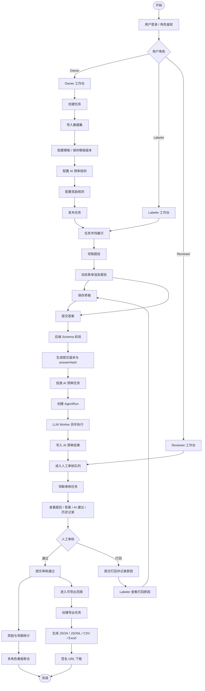

### 2.2 任务配置与发布流程

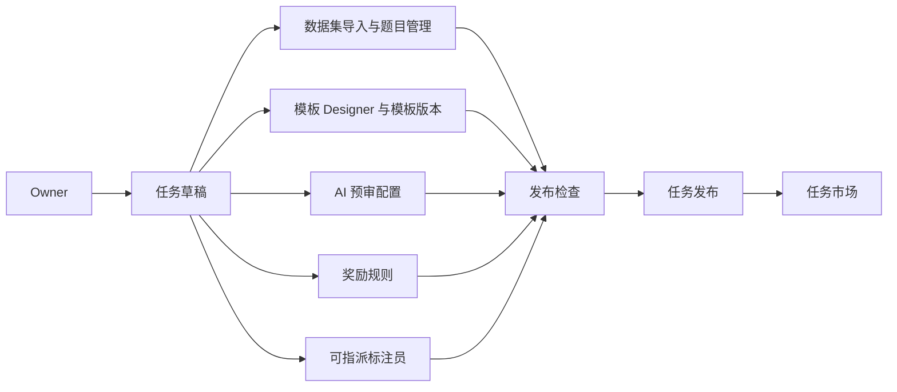

### 2.3 Labeler 标注提交流程

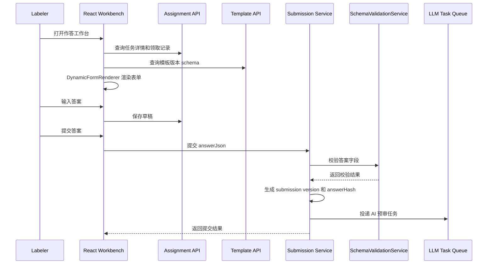

### 2.4 AI 预审与人工审核流程

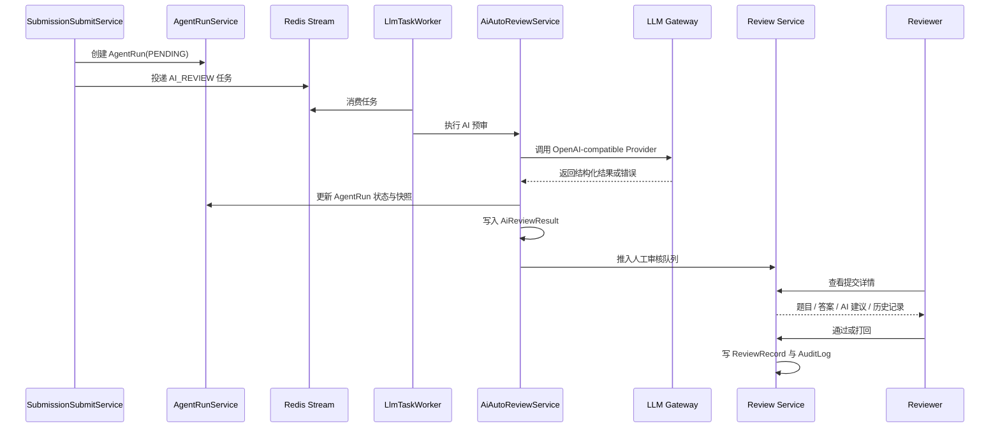

## 3. 项目架构图

### 3.1 总体架构

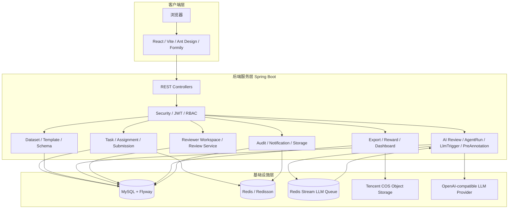

### 3.2 前端架构

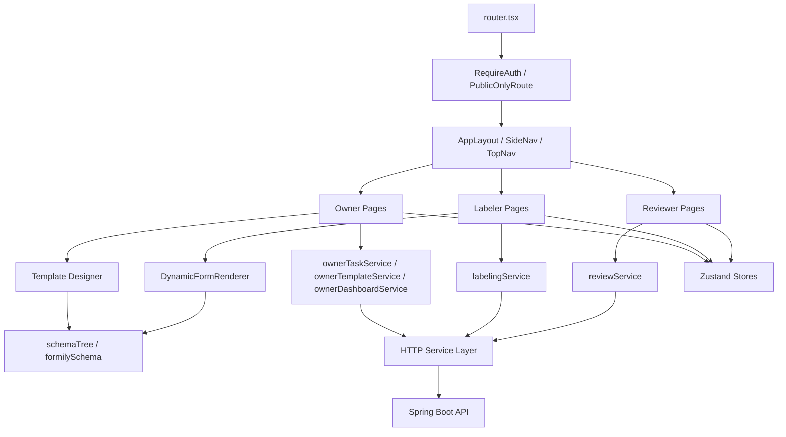

### 3.3 后端模块架构

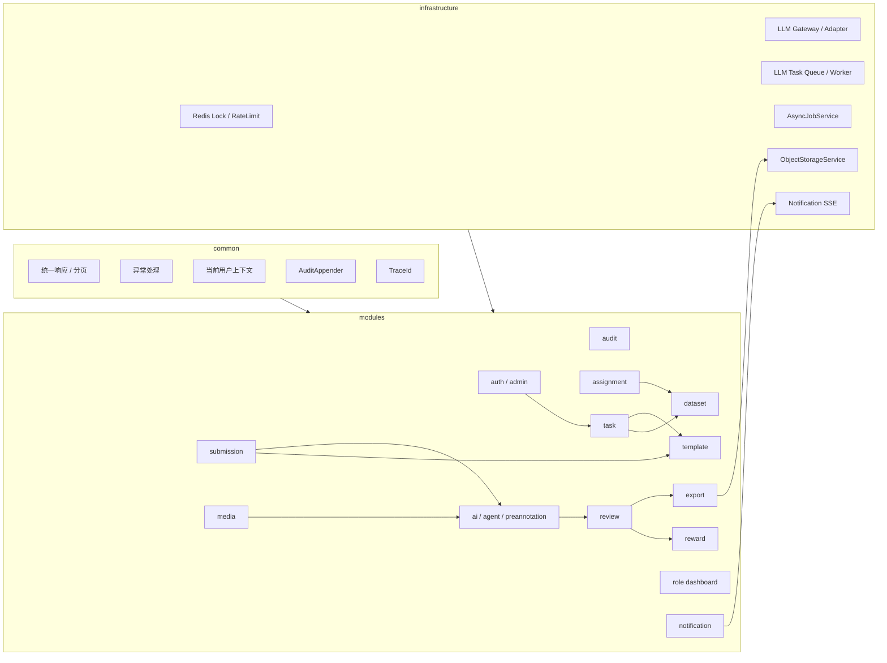

### 3.4 数据与追溯架构

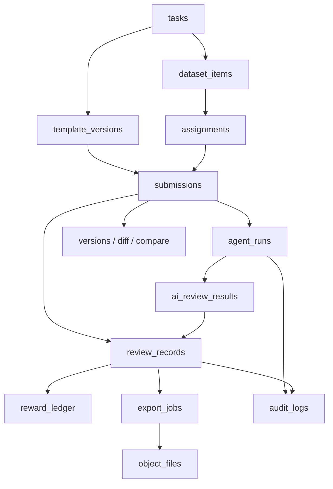

## 4. 核心模块说明

| 模块 | 已完成职责 |
| --- | --- |
| Auth / Admin | 注册登录、JWT、当前用户、用户管理、角色管理、审核分配查询、Admin 看板 |
| Task | 任务创建、编辑、发布、暂停、恢复、结束、Owner 任务列表、可分配标注员查询 |
| Dataset | 数据导入、导入任务、题目列表、批量追加、批量更新、批量删除、题目快照 |
| Template | Owner 模板库、任务模板版本、Schema 保存、Schema 校验、答案校验 |
| Assignment | 任务市场、题目领取、草稿保存、领取查询、指派记录、Labeler 工作台数据 |
| Submission | 提交版本、answerHash 幂等、提交创建人、Labeler 提交列表、版本追溯、字段 diff |
| AI / Agent | LLM Provider、AI 配置、AgentRun、AI 预审、重试恢复、AI 日志、字段级 LLM 辅助 |
| PreAnnotation | 基于 assignment 的题目级 AI 预标注建议 |
| Review | Reviewer 工作台、审核领取、单条通过、单条打回、批量审核、审核记录 |
| Export | 异步导出、直接导出、导出历史、JSON/JSONL/CSV/Excel 文件生成 |
| Reward | 奖励规则、奖励结算、贡献概览、趋势、任务明细、奖励流水 |
| Dashboard | Admin、Owner、Labeler、Reviewer 多角色看板 |
| Audit / Notification | 审计日志、SSE 通知流、通知历史、未读数 |
| Storage / Media | 文件上传、签名 URL、对象文件元数据、媒体处理与上下文提取 |

## 5. 关键状态流转

### 5.1 任务状态

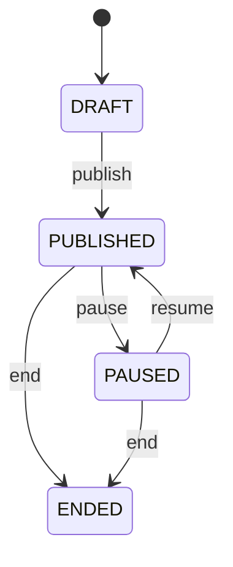

任务发布前完成数据集、模板版本、AI 配置、奖励规则和参与策略相关配置。发布后进入任务市场，暂停后停止作为新的领取入口，结束后保留查询、统计和导出能力。

### 5.2 标注与提交状态

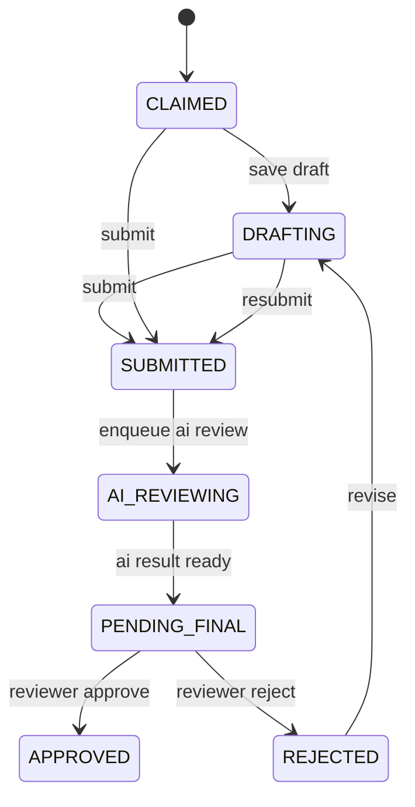

提交版本通过 `version_no` 保留历史，通过 `answer_hash` 支持重复提交幂等。打回后 Labeler 可查看原因并重新提交，新版本不会覆盖历史版本。

### 5.3 AI 任务状态

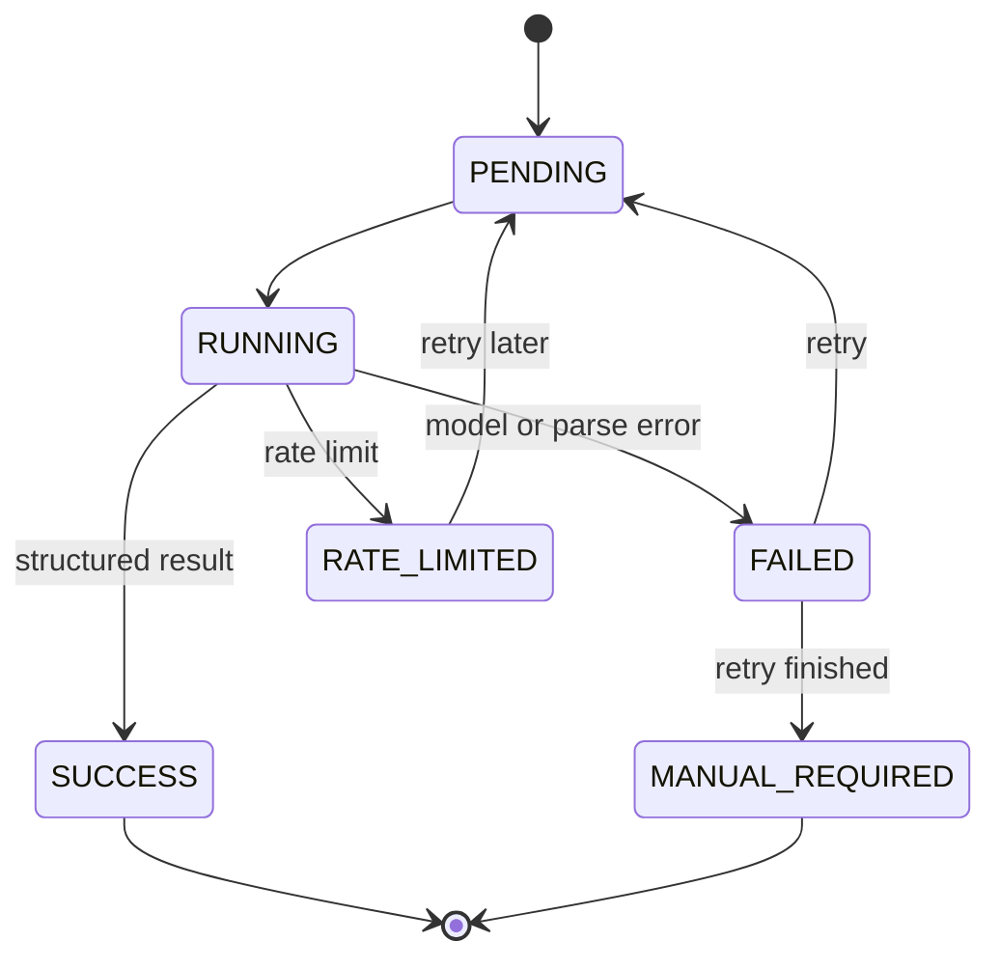

AI 预审结果只作为 Reviewer 的审核参考。无论 AI 成功或进入人工处理状态，人工审核入口都会保留，保证主链路可完成。

## 6. 关键技术点

### 6.1 动态表单 Designer / Renderer

前端通过 `features/dynamic-form` 完成模板设计和作答渲染：

- `MaterialPalette` 提供输入、展示、容器、文件、JSON 和 LLM 辅助类组件。
- `DesignerCanvas`、`PropertyPanel`、`SchemaManagerPanel` 完成画布搭建、属性编辑和 schema 管理。
- `formilySchema.ts` 将设计树转换为 Formily 可渲染结构。
- `DynamicFormRenderer` 在 Labeler 作答工作台按 schema 渲染题目和答案字段。

后端通过模板模块完成强校验：

- 模板版本保存 `schema_json`。
- `SchemaValidationService` 校验 schema 结构和 answerJson。
- `AnswerSchemaValidator` 被提交链路复用，覆盖必填、枚举、正则、字段路径等规则。

### 6.2 提交版本与 answerHash 幂等

Labeler 提交后，后端不会简单覆盖答案，而是生成提交版本：

- `SubmissionSubmitService` 校验 assignment 属主和任务状态。
- 提交前调用 `AnswerSchemaValidator` 做正式答案校验。
- `SubmissionVersionService` 维护版本号。
- answerJson 经过 canonical hash 计算得到 `answer_hash`。
- 相同答案重复提交时复用已有结果，避免重复有效提交。
- 打回修改后生成新版本，历史版本可通过追溯接口查询。

### 6.3 AI Agent 工程化链路

AI 预审不是同步阻塞接口，而是异步执行：

- 提交成功后创建 `AgentRun(PENDING)`。
- `LlmTaskQueueService` 将 AI 任务写入 Redis Stream。
- `LlmTaskWorker` 消费消息并分派给 `AiReviewLlmTaskHandler`。
- `AiAutoReviewService` 负责 Prompt 构造、LLM 调用、结构化结果解析和状态推进。
- `DefaultLlmGateway` 统一 OpenAI-compatible Provider 调用、超时、错误映射和 JSON 提取。
- `AiReviewRetryStrategy`、`AiReviewRetryScheduler`、`AiReviewRecoveryRunner` 处理重试和异常恢复。

该设计把 HTTP 提交、LLM 调用和人工审核解耦，保证模型服务波动时主业务仍然可继续处理。

### 6.4 LLM Provider 全局管理

Provider 由 Admin 全局维护，Owner 在任务 AI 配置中选择启用项：

- `AdminLlmProviderController` 支持 Provider 查询、新增、编辑、启用、停用和连通性测试。
- `LlmProviderController` 面向 Owner 查询启用 Provider。
- `LlmProviderService` 负责 Provider 配置、密钥脱敏和可用性校验。
- `OpenAiCompatibleProviderTester` 用于连通性测试。

这样可以把模型接入配置集中管理，避免不同任务重复维护密钥和 Provider 参数。

### 6.5 字段级 LLM 辅助与题目级预标注

项目将 AI 能力拆为三类：

- AI Review：提交后的自动预审，服务人工审核。
- LlmTrigger：作答过程中的字段级辅助，结果由用户确认后再进入答案。
- PreAnnotation：基于 assignment 的题目级预标注建议，为 Labeler 提供整题参考。

三类能力复用 LLM Gateway、AgentRun 或运行日志、Redis Stream 任务队列和 Provider 配置，避免重复建设模型调用链路。

### 6.6 审核领取与人工审核

Reviewer 审核链路包含任务领取、队列查询、详情查看和审核动作：

- `ReviewTaskClaimService` 维护 Reviewer 对任务的领取关系。
- `ReviewerWorkspaceController` 提供 Reviewer 任务、任务 item、看板和 AI 状态摘要。
- `ReviewController` 提供待审列表、详情、通过、打回和批量处理。
- `ReviewService` 写入 `ReviewRecord`，并推进 submission 与 assignment 状态。
- `V39__submission_review_claim_indexes.sql` 为提交审核领取查询增加索引支撑。

审核动作以人工结论为准。AI 结果、历史版本、字段 diff 和审计时间线为 Reviewer 提供上下文。

### 6.7 可追溯审计链路

一次提交可以按以下链路追溯：

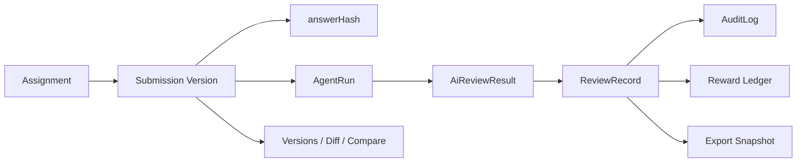

已完成追溯能力包括：

- `GET /api/v1/submissions/{submissionId}/versions`
- `GET /api/v1/submissions/{submissionId}/diff`
- `GET /api/v1/submissions/compare`
- `GET /api/v1/tasks/{taskId}/ai-review-logs`
- `GET /api/v1/tasks/{taskId}/llm-trigger-runs`
- `GET /api/v1/audit-logs`

### 6.8 导出与对象存储

导出模块将审核通过的数据生成文件：

- `ExportController` 创建异步导出任务并查询导出历史。
- `TaskExportController` 支持直接导出。
- `ExportJobService` 组织导出状态、文件生成和对象存储上传。
- `SubmissionExportQueryService` 提供审核通过提交快照。
- `FileService` 和 `ObjectStorageService` 负责对象文件元数据与签名 URL。

支持 JSON、JSONL、CSV、Excel 格式。文件二进制进入对象存储，数据库保存文件元数据和 objectKey。

### 6.9 Redis / Redisson 基础设施

Redis 在项目中承担三类基础能力：

- 锁：领取、奖励规则保存等任务维度并发控制。
- 限流：AI Provider 或任务维度调用保护。
- 队列：AI Review、LlmTrigger、PreAnnotation 的 Redis Stream 任务分发。

关键实现包括：

- `RedisLockService`
- `RedissonRedisLockService`
- `RateLimitService`
- `RedissonRateLimitService`
- `LlmTaskQueueService`
- `RedissonLlmTaskQueueService`
- `LlmTaskWorker`

### 6.10 多角色看板与通知

项目提供四类看板：

- Admin：平台级用户、任务、提交、审核和 AI 运行摘要。
- Owner：任务进度、质量、待处理事项和导出入口。
- Labeler：个人领取、提交、审核结果、贡献和奖励摘要。
- Reviewer：待审任务、待审提交、已处理量和 AI 摘要。

通知模块提供 SSE 通知流、通知历史、未读数、单条已读和全部已读能力，用于任务、审核和系统消息提醒。

## 7. 关键接口流向

| 场景 | 前端入口 | 后端模块 | 主要接口 |
| --- | --- | --- | --- |
| 登录 | `LoginPage` | `auth` | `POST /api/v1/auth/login` |
| Owner 任务列表 | `OwnerTasksPage` | `task` | `GET /api/v1/owner/tasks` |
| 任务发布 | `OwnerTaskEditorPage` | `task` | `POST /api/v1/tasks/{taskId}/publish` |
| 数据导入 | `OwnerTaskEditorPage` | `dataset` | `POST /api/v1/tasks/{taskId}/imports` |
| 模板保存 | `OwnerTemplateDesignerPage` | `template` | `POST /api/v1/tasks/{taskId}/templates` |
| AI 配置 | `OwnerTaskEditorPage` | `ai` | `POST /api/v1/tasks/{taskId}/ai-review-configs` |
| 任务市场 | `LabelerMarketPage` | `assignment` | `GET /api/v1/market/tasks` |
| 领取题目 | `LabelerWorkbenchPage` | `assignment` | `POST /api/v1/tasks/{taskId}/items/claim` |
| 保存草稿 | `LabelerWorkbenchPage` | `assignment` | `PUT /api/v1/claims/{claimId}/draft` |
| 提交答案 | `LabelerWorkbenchPage` | `submission` | `POST /api/v1/claims/{claimId}/submit` |
| 字段级 LLM 辅助 | `LabelerWorkbenchPage` | `ai` | `POST /api/v1/assignments/{assignmentId}/llm-triggers` |
| 题目级预标注 | `LabelerWorkbenchPage` | `preannotation` | `POST /api/v1/assignments/{assignmentId}/pre-annotations/run` |
| 审核队列 | `ReviewerQueuePage` | `review` | `GET /api/v1/reviewer/submissions` |
| 审核详情 | `ReviewerReviewDetailPage` | `review` | `GET /api/v1/reviewer/submissions/{submissionId}` |
| 审核通过 | `ReviewerReviewDetailPage` | `review` | `POST /api/v1/reviewer/submissions/{submissionId}/approve` |
| 审核打回 | `ReviewerReviewDetailPage` | `review` | `POST /api/v1/reviewer/submissions/{submissionId}/reject` |
| 导出任务 | Owner 任务页 | `export` | `POST /api/v1/tasks/{taskId}/exports` |
| 文件下载 | Owner 任务页 | `storage` | `GET /api/v1/files/{fileId}/signed-url` |

## 8. 数据库迁移与质量保障

项目使用 Flyway 管理数据库迁移，当前提交口径包含 `V39__submission_review_claim_indexes.sql`。关键迁移方向包括：

- 系统用户初始化。
- 数据集与任务主表。
- 模板版本与 Owner 归属。
- AI 配置、AI 结果、AgentRun 和可观测字段。
- Admin 全局 LLM Provider。
- 审核领取表与提交审核领取索引。
- 提交创建人字段。
- 任务指派标注员字段。

质量保障包括：

- `DatabaseMigrationNamingTest` 校验迁移命名。
- `DatabaseMigrationSafetyTest` 校验迁移安全规则。
- `DatabaseCommentMigrationTest` 校验表和字段注释。
- `ApiContractMappingTest` 锁定关键 Controller 路径。
- 各模块 Service / Controller 测试覆盖任务、提交、AI、审核、导出、模板、数据集、看板和文件能力。

## 9. 答辩展示流程

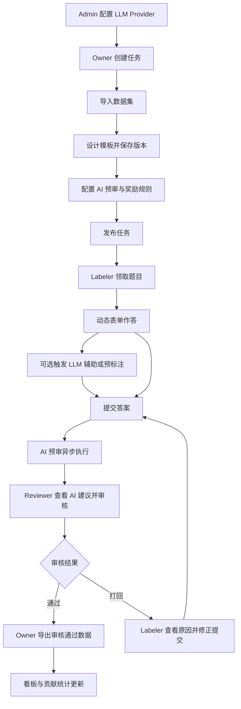

该流程能覆盖项目核心能力：多角色权限、动态表单、数据集导入、提交版本、AI Agent、人工审核、导出、奖励统计、看板和审计追溯。
