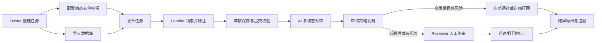

# LabelHub 项目亮点与技术难点说明

## 1. 项目定位

LabelHub 是一个面向数据标注生产链路的平台，目标不是只完成“录入答案”这一小段功能，而是把真实标注工作中会遇到的任务配置、数据导入、标注提交、AI 辅助审核、人工复核、结果导出和过程追溯串成完整闭环。

传统标注工具常见的问题有三个：

- 标注表单写死，任务类型一变化就需要重新开发页面。
- 审核主要依赖人工，效率低，也难以及时发现低质量答案。
- 审核过程不透明，后续很难解释某条数据为什么通过或被打回。

本项目围绕这些问题做了扩展：前端提供基于用户身份的工作台和动态表单能力，后端提供任务与审核状态流转，AI 部分提供多模态理解和可配置审核策略，最终形成一条可演示、可解释、可扩展的数据生产链路。

## 2. 总体业务流程

这条链路的核心价值是：Owner 可以灵活配置任务，Labeler 可以按模板完成标注，AI 可以提前识别明显问题，Reviewer 保留最终裁决权，平台保留完整过程记录。

## 3. 项目核心亮点

### 3.1 身份化工作台：解决不同用户操作入口混乱的问题

LabelHub 不是单页面工具，而是同时服务 Owner、Labeler、Reviewer 三类角色。三类用户关注的信息完全不同：Owner 关心任务、模板、数据导入和结果导出；Labeler 关心可领取任务、作答进度、草稿和打回原因；Reviewer 关心待审队列、AI 建议、审核历史和批量处理。

前端因此采用基于用户身份的工作台设计。用户登录后，系统根据当前身份进入对应工作台；侧边导航、页面操作和列表内容也围绕当前身份组织。这样做解决了两个问题：

- 降低用户认知负担。每个角色只看到自己需要处理的任务和入口。
- 降低页面复杂度。不同角色的业务流程分开组织，不把所有按钮堆在一个页面里。

难点在于三类角色共用同一套应用壳，但业务页面、导航、权限和状态又必须隔离。项目的处理方式是：布局、导航、页面标题、空态、加载态、错误态使用统一规范；角色相关页面按 Owner、Labeler、Reviewer 三条主线拆分。这样既保持整体体验一致，又避免角色逻辑互相污染。

### 3.2 动态表单 Designer：解决标注模板写死的问题

数据标注任务差异很大。图像分类、文本问答、视频内容理解、结构化抽取需要的字段和校验规则都不一样。如果每类任务都单独开发页面，维护成本很高，也不利于平台扩展。

因此项目实现了动态表单 Designer。Owner 可以在浏览器里通过“物料区、画布区、属性区”的方式搭建模板：从物料区选择输入框、选择项、展示项、文件项、JSON 编辑器、LLM 辅助块、分组和 Tab 等组件，拖入画布后再编辑标题、字段、选项、必填规则、条件显隐和联动关系。

这个功能解决了几个问题：

- 新任务不一定需要重新开发页面，只需配置模板。
- 模板结构可被序列化，便于保存、复制、导入和版本化。
- Owner 能在保存前直接预览运行态效果，减少配置错误。
- 复杂任务可以用分组和 Tab 拆分，避免长表单失控。

难点在于拖拽设计器不能只追求“能拖动”，还要保证拖出来的结构后续能被标注页和审核页复用。项目选择用可序列化 schema 作为 Designer 的唯一产物，不在 schema 里保存函数、组件实例或运行时对象。这样 Designer 负责配置体验，Renderer 负责运行态展示，后端负责保存版本和最终校验。

### 3.3 动态表单 Renderer：解决设计态和运行态不一致的问题

动态表单最容易出现的问题是：设计器看起来能配置，但真正给标注员使用时渲染不出来，或者提交的数据结构和模板不一致。

项目把 Designer 和 Renderer 明确分离。Designer 负责搭建模板，Renderer 负责按照同一份模板渲染作答表单、预览表单和审核只读表单。这样同一份模板可以在三个场景复用：

- Owner 设计时实时预览。
- Labeler 作答时填写答案。
- Reviewer 审核时只读查看提交内容。

这个设计解决了“页面重复开发”和“模板解释不一致”的问题。前端不需要为每个任务写单独表单，也不需要为审核页再写一套展示逻辑。

难点在于表单规则不仅是静态字段，还包含条件显隐、条件必填、条件禁用和联动选项。项目的方案是把这些规则也做成可序列化配置，再由 Renderer 转换为运行时表单行为。这样既支持灵活交互，又不引入不可保存、不可审计的任意脚本。

### 3.4 前端状态与服务层：解决页面状态散乱和流程难复用的问题

平台页面很多，如果每个页面都直接请求接口、直接维护 loading、error、filter、draft、submit 等状态，后期会很难维护。项目在前端做了状态和服务层拆分：

- 服务层负责封装任务、模板、标注、审核、导出等数据访问。
- 状态层负责保存列表筛选、当前详情、草稿、保存状态、提交状态、审核动作状态等。
- 页面负责组合布局和触发动作，不把复杂业务状态散落在组件里。

这个设计解决了三个问题：

- 页面逻辑更清楚。页面关注“展示什么”和“用户点了什么”。
- 状态能复用。比如草稿保存状态、审核队列筛选、模板设计器选中节点都可以跨组件共享。
- 更容易从 Mock 切换到真实接口。因为页面不直接依赖数据来源。

难点在于前端状态不能替代后端裁决。项目明确把“最终业务状态”交给后端返回，前端只负责交互连续性和用户反馈。比如任务发布、答案提交、AI 审核、人工审核和导出结果，都不在浏览器里自行裁决。

### 3.5 Labeler 作答体验：解决长流程标注容易丢失和返修困难的问题

标注员作答不是一次性填完就结束。实际场景里会遇到切题、跳题、刷新页面、保存失败、提交失败、被打回后修改等情况。如果前端只提供一个普通表单，用户体验会很差。

项目的 Labeler 工作台围绕“持续作答”设计：

- 任务市场支持搜索、筛选、领取和继续标注。
- 作答工作台展示题目列表、当前题目、动态表单和提交区。
- 草稿支持保存、恢复和状态提示。
- 提交前执行表单校验，失败时保留输入并提示错误。
- 被打回后展示 AI 或人工的打回原因，并基于上一轮答案继续修改。
- 我的提交页面展示已提交、通过、打回、待修改等状态。

这个功能解决的是“标注过程可恢复、可继续、可返修”的问题。它让平台更接近真实标注工具，而不是一次性的问卷页面。

难点在于草稿、历史答案、当前编辑值和最终提交不能混在一起。项目的方案是把它们按阶段区分：草稿用于保护未提交输入，提交生成正式记录，打回后基于上一轮答案生成新编辑状态，重新提交不覆盖旧记录。

### 3.6 Reviewer 审核体验：解决 AI 结果和人工判断割裂的问题

审核员需要同时看原始题目、标注答案、AI 建议、历史记录和当前可执行动作。如果这些信息分散在多个页面，审核效率会很低，也容易误判。

项目的 Reviewer 工作台把审核队列和审核详情拆开：

- 审核队列按任务、状态、风险等级、AI 结论等信息组织待处理项。
- 审核详情集中展示题目、答案、AI 评分、风险提示、审核历史和操作区。
- 标注答案可以用动态表单只读渲染，保证审核看到的是提交时的结构化内容。
- 打回操作要求填写原因，避免无理由退回。
- 批量处理有选择限制、二次确认和结果反馈。

这个功能解决的是“审核上下文不足”和“批量操作风险高”的问题。前端通过信息聚合和操作约束，让 Reviewer 在一个页面内完成判断，同时降低误操作概率。

难点在于 AI 通过、AI 打回、人工复核、人工已完成等状态不能混在一起操作。项目的方案是把 AI 结果作为队列筛选和操作权限的一部分，只允许对需要人工复核且未完成的记录执行审核动作。

### 3.7 AI 预审可视化：解决 AI 黑盒结论难以被人工采纳的问题

AI 审核如果只显示“通过”或“打回”，Reviewer 很难判断模型是否可信，Labeler 也很难理解自己为什么被退回。因此前端把 AI 预审结果设计成可解释面板，而不是一个简单状态标签。

AI 面板重点展示：

- 总体结论。
- 评分维度和分值。
- 命中原因。
- 风险提示。
- 推荐动作。
- 原始提示词和结构化返回摘要。
- 人工复核结论。

这个功能解决的是“AI 结果可理解、可对照、可回看”的问题。Reviewer 可以把 AI 当作参考依据，而不是盲目相信；Labeler 在返修时也能看到更具体的问题描述。

难点在于 AI 结果可能缺失、超时或异常。项目采用降级展示：AI 不可用时不阻塞人工审核，页面展示“结果暂不可用”或异常原因，让用户继续走人工流程。

### 3.8 导出与审计前端：解决长任务和历史结果不可见的问题

数据导出通常不是同步小操作，特别是 JSON、JSONL、CSV、Excel 多格式导出会涉及字段映射、审核记录、原始数据和结果文件生成。如果前端只做一个“下载按钮”，用户不知道任务是否生成成功，也无法回看历史。

项目前端把导出设计成任务中心：

- 创建导出任务。
- 展示导出进度。
- 查询导出历史。
- 提供下载入口。
- 支持字段映射、重命名、是否包含审核记录等配置。

审计日志则用于展示操作人、角色、时间、状态变化、操作原因和关联对象。这样 Owner 和 Reviewer 可以回看关键状态变化，知道数据从哪里来、经过了哪些处理。

难点在于导出和审计都属于“异步且跨模块”的体验。项目选择把导出任务状态和审计事件做成独立可查看对象，而不是隐藏在某个单独页面按钮背后。

### 3.9 多模态识别：解决图片、视频、图文混合数据无法统一审核的问题

真实标注数据不一定都是纯文本。任务中可能包含图片、视频、Markdown 图文内容，也可能包含上传文件、关键帧、转写文本等辅助信息。如果直接把这些字段拼进提示词，模型可能读不到有效信息，或者在缺少媒体材料时产生不可靠判断。

项目为此设计了多模态上下文处理能力。平台会先识别数据项属于文本、图片、视频还是图文混合类型，然后整理出 AI 可以使用的上下文：

- 图片任务会把图片作为视觉输入，并附带文本说明。
- 视频任务优先使用视频输入；如果模型或环境不支持，则使用关键帧和转写文本进行降级审核。
- 图文混合任务会提取正文中的图片信息，组合文本和图片一起送入模型。
- 纯文本任务则走普通文本审核链路。

这个功能的价值在于把不同媒体形态统一到同一套 AI 审核流程中，避免为每种数据类型单独写一套审核逻辑。

难点主要有两个：模型能力不一致、数据质量不稳定。项目没有选择“缺什么就直接失败”，而是采用可解释降级策略。系统会记录当前使用了什么媒体、是否发生降级、缺少哪些材料。如果发生降级，AI 结果不会轻易自动通过，而是更倾向于进入人工审核。

### 3.10 AI 审核策略：解决人工审核效率低和 AI 不可信的问题

AI 审核不是简单调用一次大模型，然后把模型回答当成最终结果。项目把 AI 审核设计成一个可配置、可追溯、可兜底的审核系统。

这个功能存在的原因是：人工审核质量高，但成本高；AI 审核效率高，但存在误判风险。因此平台采用“AI 先判断，人工可兜底”的策略，让 AI 处理明显正确或明显错误的数据，把不确定、有风险、低置信度的结果交给人工。

策略判断不是只看模型结论，还会结合置信度、风险标记、是否多模态降级、通过阈值、拒绝阈值以及任务配置。只要存在风险或置信度不足，就转人工审核。

这个设计解决了“AI 不可信”的问题：系统没有把 AI 当成绝对裁判，而是把它作为可配置的审核助手。AI 能提高效率，但最终是否自动流转由规则和阈值共同决定。

## 4. 主要技术难点与解决思路

### 4.1 前端信息架构：不同身份、不同流程不能堆成一个大页面

难点：Owner、Labeler、Reviewer 的任务目标不同，如果强行共用页面，会导致入口混乱、按钮过多、状态难理解。

解决思路：

- 按身份拆分工作台入口。
- 共用统一布局、导航、页面标题和反馈样式。
- 每类身份只展示当前身份需要处理的业务对象。
- 前端权限只做体验层控制，最终权限由后端确认。

这样能兼顾平台一致性和身份专注度。

### 4.2 动态表单：既要灵活，又要可控

难点：如果模板完全自由，前端渲染、后端校验和后续导出都会变得不可控；如果模板限制太死，又失去动态表单价值。

解决思路：

- 使用物料体系限制可选字段类型。
- 使用父子组件规则限制布局结构。
- 使用可序列化 schema 保证模板可保存、可预览、可复用。
- 使用模板版本保证任务发布后的结构稳定。
- 使用后端校验兜底，确保提交数据符合模板规则。

这样既允许 Owner 配置任务，又不会让提交数据脱离平台可处理范围。

### 4.3 Designer 与 Renderer：同一份 schema 要服务多个场景

难点：设计器、标注页、审核页都要理解模板。如果三处各自解释模板，很容易出现预览正常、作答异常、审核显示不一致的问题。

解决思路：

- Designer 只产出业务 schema。
- Renderer 只消费业务 schema。
- 预览、作答、审核只读展示复用同一套渲染能力。
- 条件显隐、联动、校验都以可序列化规则表达。

这个方案牺牲了一部分“随意写脚本”的自由度，但换来了模板可保存、可追溯和可复用。

### 4.4 标注工作台：长表单输入不能因为失败而丢失

难点：标注员可能长时间作答，期间会切题、刷新、保存失败或提交失败。如果页面状态处理不好，用户输入很容易丢失。

解决思路：

- 草稿保存和正式提交分离。
- 表单值变化后保留当前输入状态。
- 保存失败时不清空页面输入。
- 提交失败时保留草稿和当前答案。
- 打回后基于上一轮答案继续修改，而不是重新从空表单开始。

这样能显著降低标注员的返工成本。

### 4.5 审核前端：AI 建议要可解释，人工动作要可约束

难点：AI 结果可能只是建议，人工审核才是最终质量保障。如果 AI 信息展示不清楚，Reviewer 不会信任；如果人工按钮缺少限制，批量操作容易误伤。

解决思路：

- AI 结果展示结论、风险、原因、建议和原始摘要。
- 审核详情把题目、答案、AI 建议、历史记录放在同一个上下文里。
- 打回必须填写原因。
- 批量操作限制可选范围，操作前二次确认，操作后逐条反馈结果。
- AI 异常时降级为普通人工审核视图。

这样既保留 AI 辅助价值，又不削弱人工审核的可控性。

### 4.6 多模态数据质量不可控

难点：视频、图片、图文混合内容经常缺字段、缺图片、缺关键帧或缺转写。直接失败会影响流程，直接相信模型又有风险。

解决思路：

- 先标准化媒体上下文，再构建 AI 输入。
- 按模型能力选择图片、多图、视频或纯文本模式。
- 媒体材料不足时采用降级策略。
- 降级结果进入风险判断，不轻易自动通过。

这样即使数据不完整，系统也能给出可解释处理结果。

### 4.7 AI 自动审核需要控制误判风险

难点：AI 可以提高效率，但错误自动通过或错误自动打回都会影响数据质量和用户体验。

解决思路：

- 把 AI 结果拆成结论、分数、置信度、风险标记、媒体理解等结构化字段。
- 使用任务级策略控制是否允许 AI 直通。
- 设置置信度、通过阈值、拒绝阈值。
- 只要出现风险标记、降级或低置信度，就转人工。

这个方案让 AI 成为“可控的辅助审核者”，而不是不可解释的黑盒裁判。

## 5. 总结

项目亮点可以归纳为五点：

- 动态化：表单、字段、校验、显隐和联动不写死，适配多类标注任务。
- 身份化：系统根据当前用户身份展示对应工作台入口和闭环流程。
- 体验连续性：草稿、提交失败保留、打回返修、审核历史和导出进度都可见。
- 智能化：AI 支持多模态输入、结构化审核、风险判断和多策略执行。
- 可控可追溯：AI 不无条件裁决，所有自动流转受策略控制，提交、AI、人工审核、修订和导出都有链路记录。

项目难点主要在于如何把“前端灵活配置”和“平台流程可靠”同时做好。最终方案是：前端通过身份化工作台和动态表单提升可用性，后端通过模板版本、审核状态流转、审计日志和 AI 策略兜底保证可靠性。
